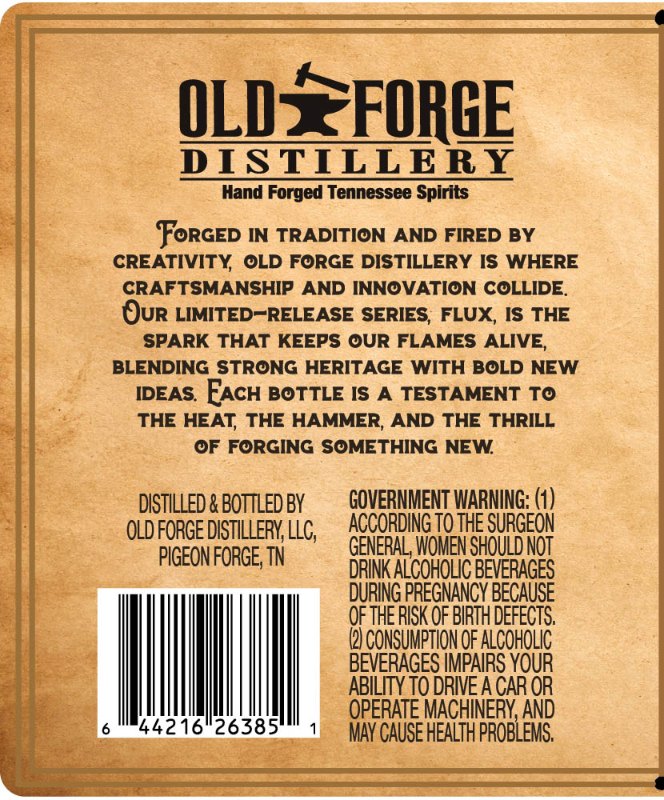
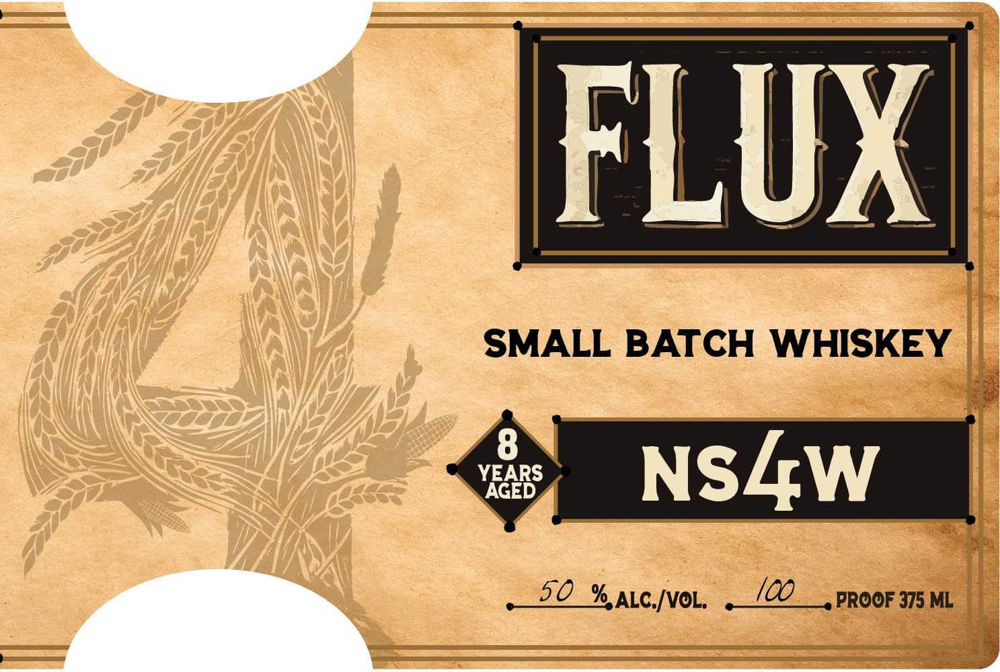
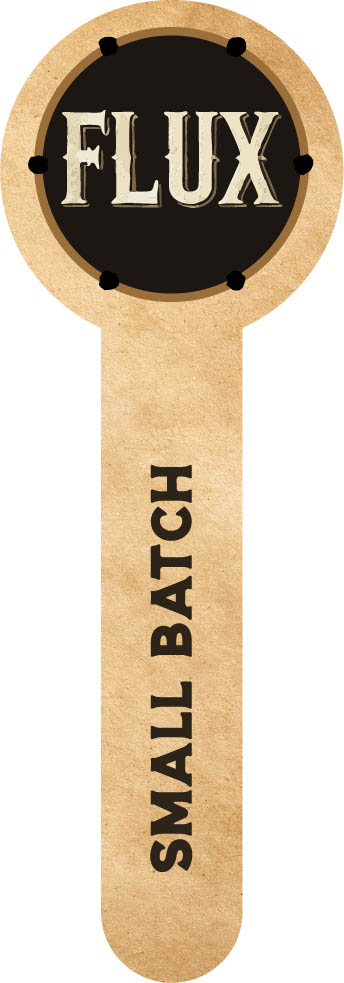

# TTB COLA Label Images - TTBID 26231001000100

**Brand Name:** FLUX

**Fanciful Name:** NS4W

**Issue Date:** 08/27/2026

**Origin Code:** 43

**Product Class/Type:** 140

**Source:** [TTB Public COLA Registry](https://ttbonline.gov/colasonline/viewColaDetails.do?action=publicFormDisplay&ttbid=26231001000100)

## Label Images

### Back Label

### Front Label

### Label 3

## Extracted Label Text

*Text extracted via OCR - may contain errors*

*1 image(s) excluded: text did not meet readability threshold*

**Detected Proof:** 100

### Back Label

QLDSFORGE
DISTILLERY
Hand Forged Tennessee Spirits
FoRGED IN TRADITION AND FIRED BY
CREATIVITY
OLD FORGE DISTILLERY IS WHERE
CRAFTSMANSHIP AND INNOVATION COLLIDE
Our LIMITED-RELEASE SERIES; FLUX, IS THE
SPARK THAT KEEPS OUR FLAMES ALIVE,
BLENDING STRONG HERITAGE WITH BOLD NEW
IDEAS FACH BOTTLE IS
TESTAMENT To
THE HEAT THE HAMMER, AND THE THRILL
OF FORGING SOMETHING NEW
DISTILLED & BOTTLED BY
GQVERNMENT WARNING:
OLD foRGE DISTILLERY LLC;
ACCORDING TO THE SURGEON
PIGEON FORGE; TN
GENERAL, WOMEN SHOULDNOT
DRINK ALCOHOLIC BEVERAGES
DURING PREGNANCY BECAUSE
OF THE RISK Qf BIRTH DEFECTS
@) CoNSuMpTIoN OF ALCOHOLic
BEVERAGES IMPAIRS YOUR
ABILITY TO DRIVE A CAR OR
OPERATE MACHINERY AND
44216"26385
MAY CAUSE HEALTH PROBLEMS

### Front Label

FLUX
SMALL BATCH WHISKEY
YAGEBS
NSLW
50
% ALC[VOL,
I0o
PROOF 375 ML
