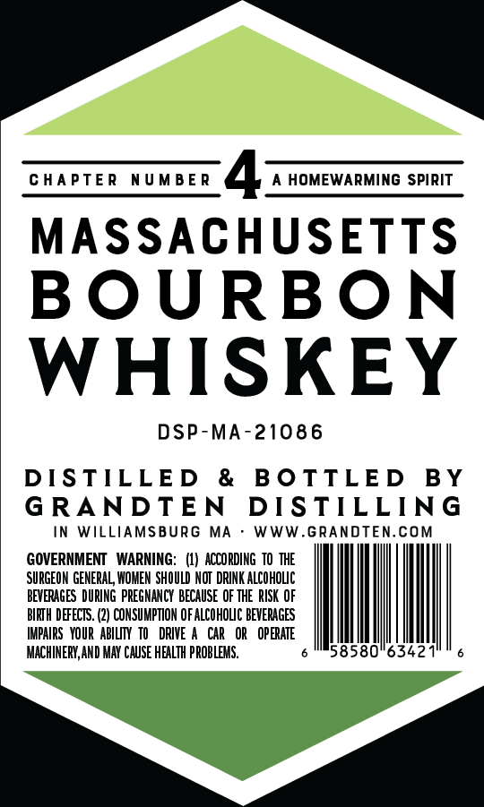
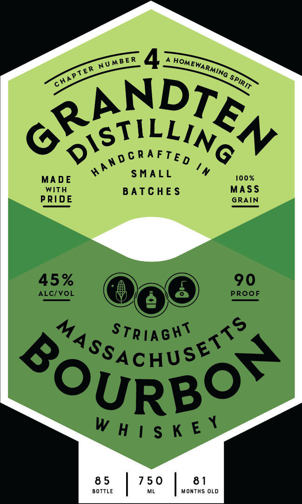

# TTB COLA Label Images - TTBID 26231001000385

**Brand Name:** GRANDTEN DISTILLING

**Issue Date:** 08/26/2026

**Origin Code:** 26

**Product Class/Type:** 101

**Source:** [TTB Public COLA Registry](https://ttbonline.gov/colasonline/viewColaDetails.do?action=publicFormDisplay&ttbid=26231001000385)

## Label Images

### Back Label

### Front Label

## Extracted Label Text

*Text extracted via OCR - may contain errors*

**Detected Proof:** 90

### Back Label

a>

CHAPTER NUMBER

4: HOMEWARMING SPIRIT

MASSACHUSETTS

BOURBON

WHISKEY

DSP-MA-21086

DISTILLED & BOTTLED BY

GRANDTEN DISTILLING

LLIAMSBURG

WW.GRANDTEN

GOVERNMENT WARNING: (1) ACCORDING TO THE

SURGEON GENERAL, WOMEN SHOULD NOT DRINK ALCOHOLIC

BEVERAGES DURING PREGNANCY BECAUSE OF THE RISK OF

IMPAIRS YOUR ABILITY TO DRIVE A CAR OR OPA

BIRTH DEFECTS. (2) CONSUMPTION OF ALCOHOLIC BEVERAGES

IACHINERY, AND MAY CAUSE HEALTH PROI

342

### Front Label

6 ANDTSN
MA DE
SMALL
100%
WITH
B ATC HE $
MASS
PRIDE
GRAIN
45%
90
ALC/VOL
PROoF
StriaGht
"AsAchused  &
SoURBOr
W h | $ K E Y
8 5
7 5 0
8 1
BOTTLE
MonTHS OLD
NUMBE R
HOMe
EWARMING
HAPTE R
SPIRIT
#andcrafted
In
