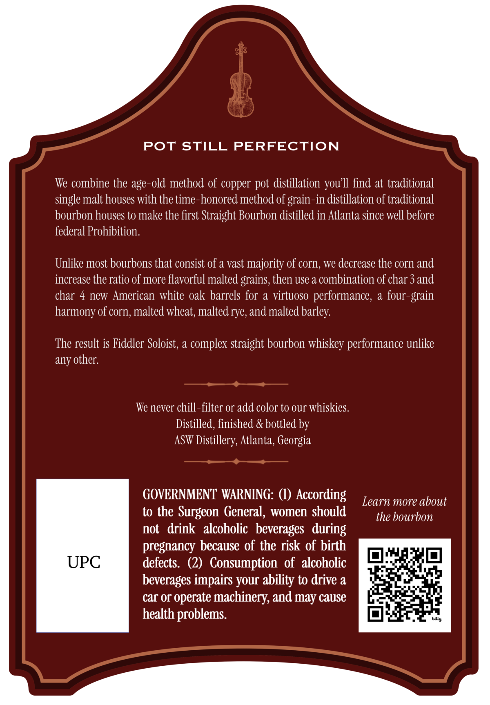
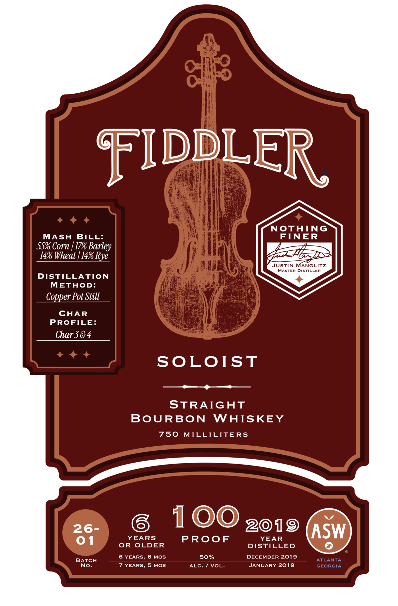

# TTB COLA Label Images - TTBID 26231001000395

**Brand Name:** FIDDLER

**Fanciful Name:** SOLOIST

**Issue Date:** 08/26/2026

**Origin Code:** 08

**Product Class/Type:** 101

**Source:** [TTB Public COLA Registry](https://ttbonline.gov/colasonline/viewColaDetails.do?action=publicFormDisplay&ttbid=26231001000395)

## Label Images

### Back Label

### Front Label

## Extracted Label Text

*Text extracted via OCR - may contain errors*

**Detected Proof:** 100
**Detected Age:** 6 Years

### Back Label

POT STILL PERFECTION
We combine the age-old method of copper pot distillation
find at traditional
single malt houses with the time-honored method of grain-in distillation of traditional
bourbon houses to make the first Straight Bourbon distilled in Atlanta Since well before
federal Prohibition.
Unlike most bourbons that consist of & vast majority of corn, we decrease the corn and
increase the ratio of more flavorful malted grains, then use a combination of char 3 and
char 4 new American white oak barrels for a virtuoso performance,
a four
harmony of corn, malted wheat, malted rye,and malted barley:
The result is Fiddler Soloist, a complex straight bourbon whiskey performance unlike
any other:
We never chill-filter or add color to our whiskies:
Distilled, finished & bottled by
ASW Distillery, Atlanta, Georgia
GOVERNMENT WARNING:
According
Learn more about
to the Surgeon General, women should
the bourbon
not  drink  alcoholic   beverages   during
pregnancy because of the risk of birth
UPC
defects   (2)  Consumption   of   alcoholic
beverages impairs your ability to drive a
car Or operate machinery, and may cause
health problems.
you II
grain
bily

### Front Label

FIDDLER
NOthING
MASH
BILL:
FINER
55% Corn | 17% Barley
14% Wheat [ 14% Rye_
JUSTIN MANGLITZ
MASTER
DISTILLER
DISTILLATION
METHOD:
Copper Pot Still
CHAR
PROFILE:
Char 38 4
SOLOIST
STRAIGAT
BoURBON
WAISKEY
750
MILLICITERS
26-
100 2019
ASW
01
YEARS
PRoof
YEAR
OR
OLDER
DISTILLED
6 YEARS, 6 MOS
50%
DECEMBER 2019
BATCH
ATLANTA
No.
7 YEARS, 5
MOs
ALC.
VOL:
JANUARY 2019
GEORGIA
