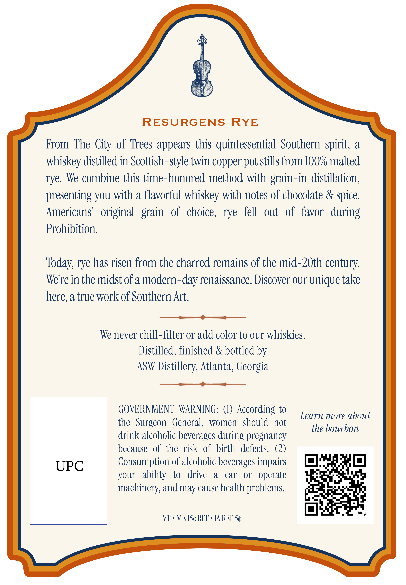
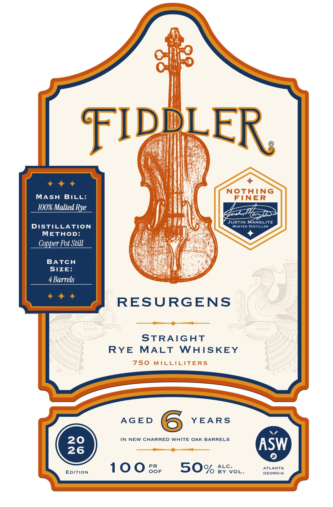

# TTB COLA Label Images - TTBID 26231001000398

**Brand Name:** FIDDLER

**Fanciful Name:** RESURGENS

**Issue Date:** 09/08/2026

**Origin Code:** 08

**Product Class/Type:** 109

**Source:** [TTB Public COLA Registry](https://ttbonline.gov/colasonline/viewColaDetails.do?action=publicFormDisplay&ttbid=26231001000398)

## Label Images

### Back Label

### Front Label

## Extracted Label Text

*Text extracted via OCR - may contain errors*

**Detected Proof:** 100
**Detected Age:** 6 Years

### Back Label

RESURGENS
RYE
From The City of Trees appears this  quintessential   Southern spirit, &
whiskey distilled in Scottish-style twin copper pot stills from 100% malted
rye. We combine this time-honored method with grain-in distillation;
presenting you with a flavorful whiskey with notes of chocolate & spice.
Americans'   original
of   choice ,  rye   fell
out  of   favor   during
Prohibition.
Tday, rye has risen from the charred remains of the mid-ZOth century:
We' re in the midst of a modern-day renaissance. Discover our unique take
here, a true work of Southern Art.
We never chill-filter or add color to our whiskies.
Distilled, finished & bottled by
ASW Distillery, Atlanta, Georgia
GOVERNMENT WARNING:
According to
Learn more about
the   Surgeon   General,
women
should not
the bourbon
drink alcoholic beverages during pregnancy
because   of the risk of birth
defects.
UPC
Consumption of alcoholic beverages impairs
your   ability
to
drive
a
car
or
operate
machinery, and may cause health problems
bitly
VT
ME 15c REF
IA REF 5c
grain

### Front Label

FIDBLER
NOTHING
MASH
BILL:
FINER
100% Malted Rye
JUSTIN MANGLITZ
DIStILLATION
MASTER Distiller
METHOD:
Copper Pot Still
BATCH
SIzE:
4 Barrels
RESURGENS
STRAIGAT
RYE
MALT
WAISKEY
750
MTLLICITERS
AGED
6
YEARS
20
IN NEW CHARRED WHITE OAK BARRELS
26
ASW
100
PR
50%
ALC
ATLANTA
EDITION
OoF
BY VoL:
GEORGIA
