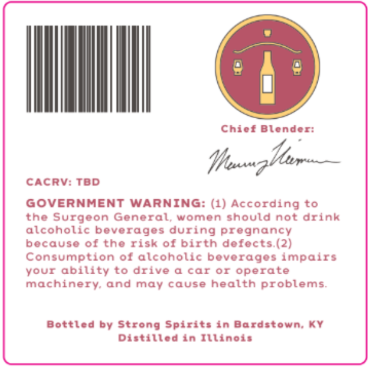
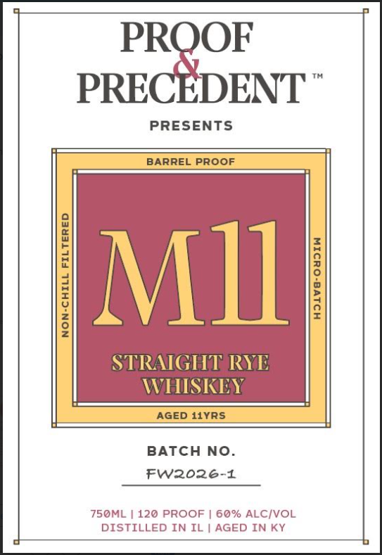

# TTB COLA Label Images - TTBID 26231001000449

**Brand Name:** PROOF & PRECEDENT

**Issue Date:** 08/27/2026

**Origin Code:** 22

**Product Class/Type:** 102

**Source:** [TTB Public COLA Registry](https://ttbonline.gov/colasonline/viewColaDetails.do?action=publicFormDisplay&ttbid=26231001000449)

## Label Images

### Back Label

### Front Label

### Label 3

## Extracted Label Text

*Text extracted via OCR - may contain errors*

**Detected Proof:** 120
**Detected Age:** 11 Years

### Back Label

Chicf Blender:
CACRV: TBD
GOVERNMENT WARNING: (1) According to
the Surgeon General; women should not drink
alcoholic boverages during pregnancy
bocauso of tho risk 0f birth dofocts (2)
Consumption 0f alcoholic beverages impairs
YOUr ability to drive
car Of operate
machinery and may cause health problems
Bottled by Strong Spirits in Bardstown; KY
Distilled in Illinois
Huztr _

### Front Label

PROOF
PRECEDENT
PRESENTS
BARREL
PROOF
1
MIlI
8
STRAIGHT RYE
WHISREY
AGED 11YRS
BATCH No_
Fw2026-1
750ML
120 PROOF | 60% ALCIVOL
DISTILLED IN IL | AGED IN KY

### Label 3

PROOF
PRECEDENT
120 PROOF
AGED 11 YEARS
