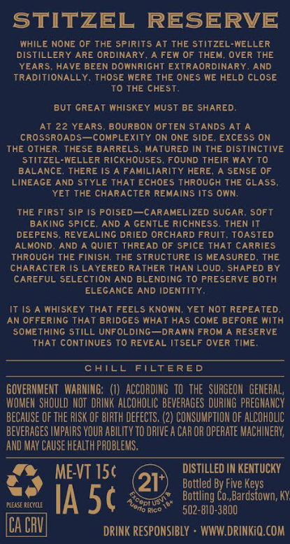
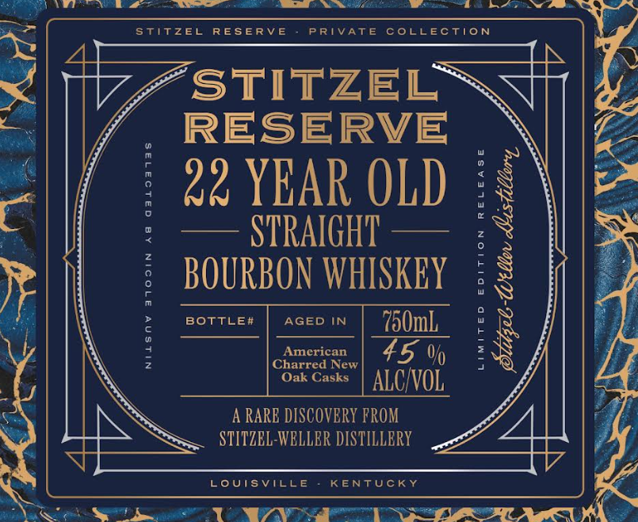

# TTB COLA Label Images - TTBID 26231001000471

**Brand Name:** STITZEL RESERVE

**Issue Date:** 08/26/2026

**Origin Code:** 22

**Product Class/Type:** 101

**Source:** [TTB Public COLA Registry](https://ttbonline.gov/colasonline/viewColaDetails.do?action=publicFormDisplay&ttbid=26231001000471)

## Label Images

### Back Label

### Front Label

## Extracted Label Text

*Text extracted via OCR - may contain errors*

**Detected Proof:** 90
**Detected Age:** 22 Years

### Back Label

STITZEL RESERVE
WHILE NONE OF THE Spirits At ThE Stitzel-WELLER
DISTILLERY ARE ORDINARY
A FEW OF THEM: OVER THE
YEARS HAVE BEEN DOWNRIGHT EXTRAORDINARY
AND
TRADITIONALLY
THOSe WERE ThE ONES WE HELD CLOSE
To THE CHEST.
but GREAT Whiskey Must BE SHARED:
AT 22 YEARS
BOURBON OFTEN STANDS AT A
CROSSROADS  complexity ON ONE SIdE, ExcESS ON
The OThER: THESE BARRELS
MATURED IN THE DISTINCTIVE
Stitzel-WELLER RICKHOUSES
FOUND TheiR WAY To
BALANCE
TheRE IS A FAMiLiARITY HeRE
SENSE OF
LINEAGE AND STYLE THAT EcHOES Through THE GLASS
YET The ChARAcTER REMAINS Its OWN;
ThE First sip IS Poised  CARAMELIZED SUGAR
SOFt
BAKING Spice
AND
GENTLE RICHNESS, THEN IT
DEEPENS
REVEALING DRIED ORCHARD FRUIT
TOASTED
ALMOND
AND
QUiEt THREAD OF Spice ThaT CARRIES
Through The Finish; THE StructurE IS MEASURED
THE
CHARACTER |S Layered RATHER THAN LOUD
SHAPED BY
CAREFUL SELEcTiON AND BLENDING To PRESERVE BOTH
ELEGANCE AND IDENTITY
IT IS
MHISKEy THAT FEELS KNOWN; YET Not REPEATED
AN OFFERING THAT BridgEs WHAT HAS cOME BEFORE Mith
SOMEThing STILL UNFOLDING
DRAMN FROM
RE SERVE
ThAT CONTINUES To REVEAL ITSELF OveR TIME ,
CATCL
FilteRED
GOVERNMENT   WARMING;   (€)   ACCORDING   tOthe   SURGEOM   GENERAL;
WOMEH  ShOuLD NOT  DRINK ALCOHOLIC BEVERAGES DURING PREGMANCY
beCauSE OF thE RISK OF BIRTH dEfects, (2) CONSUMPTION OF ALCOHOLIC
beveRAGES IMPAIRS VOUR AbIlITy TO DRIVE A CAR OR operATe MachIMeRY;
AND MaY CauSe health PROBLEMS,
ME-VT I5c
DISTILLED IN KENTUCKY
21'
Bottled By Five Keys
FLEASE RECYOlE
IA 5c
Tcopt us
Bottling Co,,Bardstown; KY
to Rico
502-810-3800
ICA CRV
DRINK RESPONSIBLY
WWW DRINKiQ.COM

### Front Label

stitzel
RESERV E
PRIVATE
coLLEction
STITZEL
RESERVE
22 YEAR OLD
:
STRAIGHT
F
0
BOURBON WHISKEY
2
9
BOTTLE#
AGED
IN
750mL
Amcrican
45 %
1
Charred New
Oak Casks
ALCIVOL
A RARE DISCOVERY FROM
STITZEL-WELLBR DISTILLERY
LoUisVIllE
KENTUckY
{
