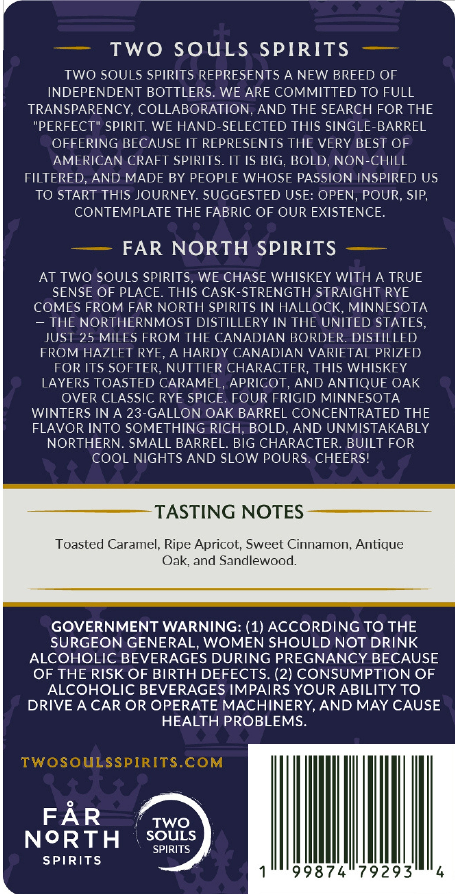
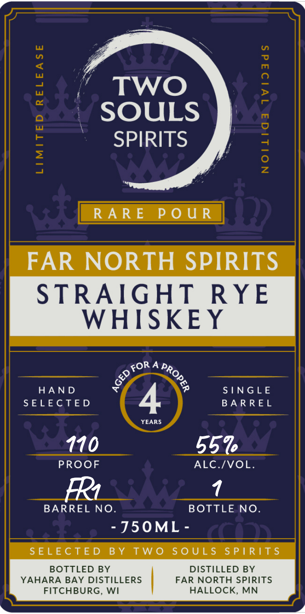

# TTB COLA Label Images - TTBID 26231001000489

**Brand Name:** TWO SOULS

**Issue Date:** 09/22/2026

**Origin Code:** 48

**Product Class/Type:** 102

**Source:** [TTB Public COLA Registry](https://ttbonline.gov/colasonline/viewColaDetails.do?action=publicFormDisplay&ttbid=26231001000489)

## Label Images

### Back Label

### Front Label

## Extracted Label Text

*Text extracted via OCR - may contain errors*

### Back Label

Two
SouLS
SPIRITS
TWO SOULS SPIRITS REPRESENTS A NEW BREED OF
INDEPENDENT BOTTLERS. WE ARE COMMITTED TO FULL
TRANSPARENCY, COLLABORATION, AND THE SEARCH FOR THE
"PERFECT" SPIRIT. WE HAND-SELECTED THIS SINGLE-BARREL
OFFERING BECAUSE IT REPRESENTS THE VERY BEST OF
AMERICAN CRAFT SPIRITS. IT IS BIG, BOLD, NON-CHILL
FILTERED, AND MADE BY PEOPLE WHOSE PASSION INSPIRED US
TO START THIS JOURNEY. SUGGESTED USE: OPEN, POUR, SIP,
CONTEMPLATE THE FABRIC OF OUR EXISTENCE.
FAR NORTH SPIRITS
AT TWO SOULS SPIRITS,
WE CHASE WHISKEY WITH A TRUE
SENSE OF PLACE. THIS CASK-STRENGTH STRAIGHT RYE
COMES FROM FAR NORTH SPIRITS IN HALLOCK, MINNESOTA
THE NORTHERNMOST DISTILLERY IN THE UNITED STATES,
JUST 25 MILES FROM THE CANADIAN BORDER. DISTILLED
FROM HAZLET RYE;
A HARDY CANADIAN VARIETAL PRIZED
FOR ITS SOFTER, NUTTIER CHARACTER, THIS WHISKEY
LAYERS TOASTED CARAMEL, APRICOT, AND ANTIQUE OAK
OVER CLASSIC RYE SPICE. FOUR FRIGID MINNESOTA
WINTERS IN A 23-GALLON OAK BARREL CONCENTRATED THE
FLAVOR INTO SOMETHING RICH, BOLD,
AND UNMISTAKABLY
NORTHERN. SMALL BARREL. BIG CHARACTER. BUILT FOR
cOOL NIGHTS AND SLOW POURS. CHEERS!
TASTING NOTES
Toasted Caramel, Ripe Apricot; Sweet Cinnamon, Antique
Oak, and Sandlewood:
GOVERNMENT WARNING: (1) ACCORDING TO THE
SURGEON GENERAL, WOMEN SHOULD NOT DRINK
ALCOHOLIC BEVERAGES DURING PREGNANCY BECAUSE
OF THE RISK OF BIRTH DEFECTS. (2) CONSUMPTION OF
ALCOHOLIC BEVERAGES IMPAIRS YOUR ABILITY TO
DRIVE A CAR OR OPERATE MACHINERY, AND MAY CAUSE
HEALTH PROBLEMS.
TWOSOuLSSPIRITS.COM
FAR
TWO
NoRTH
SOULS
SPIRITS
SPIRITS
99874
79293
4

### Front Label

’ Two
- SOULS
‘SPIRITS

RARE POUR

FAR NORTH SPIRITS

STRAIGHT RYE
WHISKEY

ORA p,
oe,
iS <
HAND x p SINGLE
SELECTED BARREL
YEARS
110 55%
PROOF ALC./VOL.
BARREL NO. BOTTLE NO.
- J50ML -
SELECTED BY TWO SOULS SPIRITS
BOTTLED BY DISTILLED BY
YAHARA BAY DISTILLERS FAR NORTH SPIRITS
FITCHBURG, WI HALLOCK, MN

QE, 66 UC (ll eee
