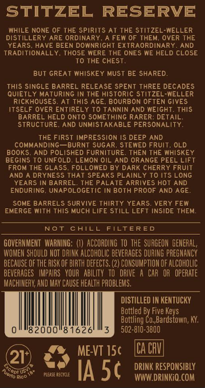
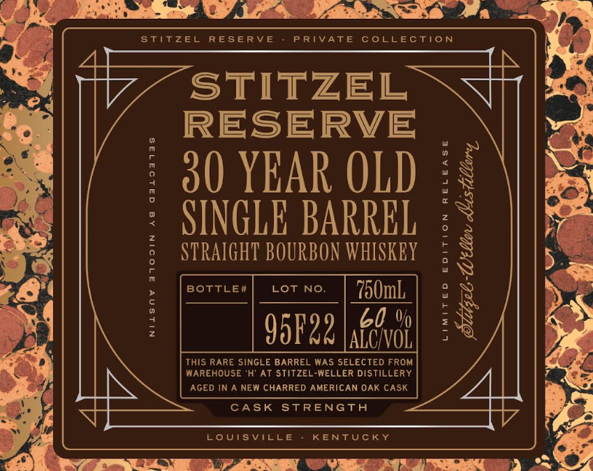

# TTB COLA Label Images - TTBID 26231001000506

**Brand Name:** STITZEL RESERVE

**Issue Date:** 08/27/2026

**Origin Code:** 22

**Product Class/Type:** 101

**Source:** [TTB Public COLA Registry](https://ttbonline.gov/colasonline/viewColaDetails.do?action=publicFormDisplay&ttbid=26231001000506)

## Label Images

### Back Label

### Front Label

## Extracted Label Text

*Text extracted via OCR - may contain errors*

**Detected Proof:** 120
**Detected Age:** 30 Years

### Back Label

STITZEL
RESERVE
WHILE NONE OF THE spirits At THE Stitzel-WELLER
DISTILLERY ARE ORDINARY
A FEW OF THEM, OVER THE
YEARS; HAVE BEEN DOWNRIGHT EXTRAORDINARY
AND
TRADITIONALLY
THOSE WERE THE ONES WE HELD CLOSE
To THE CHEST
BuT GREAT WHISKEY Must BE SHARED:
This SINGLE BARREL RELEASE SPENT THREE DECADES
QUiETLY MaTURInG In THE historic Stitzel-WELLER
RIcKHOUSES:
At This AGE
BOURBON OFTEN GIVES
ITSELF OVER ENTIRELY To TANNIN AND WEIGHT. THIS
BARREL HELD ONTO SOMEThing RARER: DETAIL;
STRUCTURE
AND UNMISTAKABLE PERSONALITY
THE FIRST IMPRESSION IS DEEP AND
COMMANDING  BURNT SUGAR
STEWED FRUIT
OLD
BOKS
AND POLISHED FURNITURE
THEN THE WHiSkEY
BEGINS To UNFOLD; LEMON 0IL AND ORANGE PEEL LIFT
FROM THE GLASS, FOLL
BY DARK CHERRY FRUIT
AND A DRYNESS THAT SPEAKS PLAINL
TO ITS LONG
YEARS IN BARREL. THE PALATE ARRIVES HOT AND
ENDURING
UNAPOLOGETIC IN BOTH PROOF AND AGE
SOME BARRELS SURVIVE THIRTY YEARS VERY FEW
EMERGE With This Much LIFE STILL LEFT INSIDE THEM:
Not
CAILL
FTLTERED
GOVERNMEHT   WARHING; (1)  ACCODING tOthe  SURGEON GENERAL,
WOMEH SHOULD NOT DRINK ALCOHOLIC beveRAGES DURING PREGNANCY
BECAUSE OF the RISK OF BIRTH defects. (2) CONSUMPTLON OF ALCOHOLIC
beveRAGES   IMPAIRS   YOUR   ABILITY  To   DRIVE
CAR  OR   opeRATE
MACHIHERY; AND MAY CAUSE HEALTH PROBLEMS;
DISTILLED IN KENTUCKY
Bottled By Five
Bottling Co,Bardstown; KY;
82000'
8 1626
502-810-3800
ME-VT 15c
ICa CRVM
211
Copi us
please cecicle
IA 5c
DRINK RESPoNSIBLY
Rico
WWW DRINKiQ.COM
OWED
 Keys
Puono '

### Front Label

Stitzel
RESERV E
P RIVATE
coLLEctioN
STITZEL
RESERVE
30 YEAR OLD
"
[
SINGLE BARREL
2
F
8
STRAIGHT BOURBON WHISKEY
9
BOTTLE#
Lot No;
750mL
60 %
F
3
95F22 |aiwvob
:
This RARE SINGLE BARREL WAS SELECTED FROM
MAREHOUSE 'H' At stitzel-WELLER DistiLLERY
IN A NEW CHARRED AMERICAN OAK CASK
CASK
STRENGTA
LoUIsville
KENTUCKY
AGED
