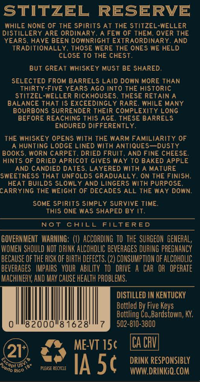
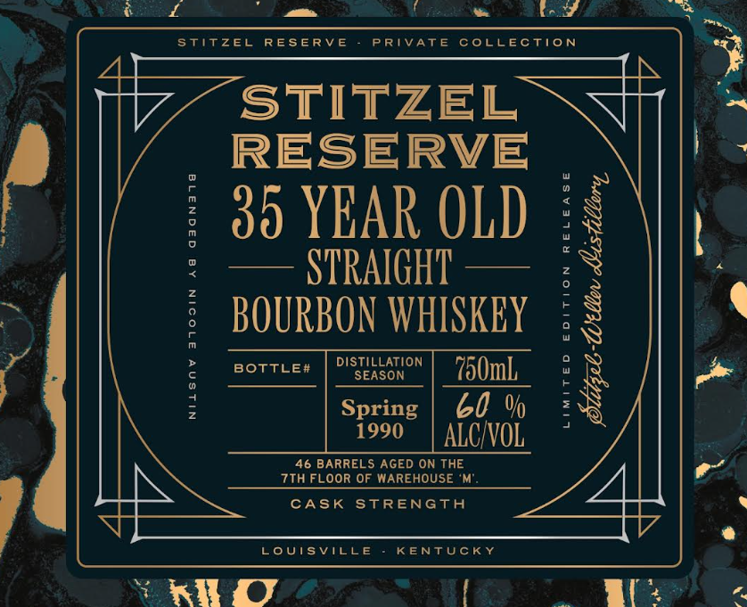

# TTB COLA Label Images - TTBID 26231001000563

**Brand Name:** STITZEL RESERVE

**Issue Date:** 08/26/2026

**Origin Code:** 22

**Product Class/Type:** 101

**Source:** [TTB Public COLA Registry](https://ttbonline.gov/colasonline/viewColaDetails.do?action=publicFormDisplay&ttbid=26231001000563)

## Label Images

### Back Label

### Front Label

## Extracted Label Text

*Text extracted via OCR - may contain errors*

**Detected Proof:** 120
**Detected Age:** 35 Years

### Back Label

STITZEL
RESERVE
WHILE NONE OF THE Spirits AT THE STiTzEL-WELLER
DISTILLERY ARE ORDINARY
A FEW OF THEM, OVER THE
YEARS, HAVE BEEN DOwNRiGHT EXTRAORDINARY
AND
TRADITIONALLY, THOSE WERE THE ONES WE HELD
CLOSE TO THE CHEST
BUT GREAT WHISKEY MUST BE SHARED.
SELECTED FROM BARRELS LAID DOWN MORE THAN
THIRty-FIVE YEARS AGO Into THE historic
StitzeL-WELLER RICKHOUSES
THESE RETAIN
BALANCE THAT iS EXCEEDINGL
RARE
WHILE MANY
BOURBONS SURRENDER THEIR COMPLEXITY LONG
BEFORE REACHING This AgE
THESE BARRELS
ENDURED DIFFERENTLY,
THE Whiskey OPENS With THE WARM FAMiLiARiTY OF
HUNTING
ODGE LINED with ANTIQUES  Dusty
BOOKS
WORN CARPET
DRIED FRUIT
AND FINE CHEESE
HINTS OF DRIED APRICOT GIVES WAY To BAKED APPLE
AND CANDIED DATES; LAYERED With A MATURE
SWEETNESS THAT UNFOLDS GRADUALLY
ON THE FINISH;
HEAT BUILDS SLOWLY AND LINGERS WITH PURPOSE
CARRYING THE WEiIGHT OF DECADES ALL THE WAY DOWN:
SOME SPIRITS SIMPLY SURVIVE TIME:
THIS ONE WAS SHAPED BY IT
Not
CHILL
FTLTERED
GOVERNMEHT   WARHING; (1) ACCORDING tO the SURGEON  GENERAL,
WOMEN SHOULD NOT DRINK ALCOHOLIC beveRAGES DURING PREGNANCY
BECAUSE OF the RISK OF BIRTH defects. (2) CONSUMPTLON OF ALCOHOLIC
beverAGES   IMPAIRS   VOUR   AbILITy   TO   dRIVE
CAR   OR   opeRATe
MACHIHERY; AND May CAUSe HeaLTh PROBLEMS.
DISTILLED IN KENTUCKY
Bottled By Five Keys
Bottling Co,Bardstown; KY,
82000"81628'
502-810-3800
ME-VT 15c
ICa CV
21
'Orlo Rico
plexsE cecycle
IA 5c
DrV Desporsebl
'Copiuso

### Front Label

Stitzel
RESERV E
PRIVate
coLEctioN
STITZEL
RESERVE
5
35 YEAR OLD
@
STRAIGHT
2
3
F
BOURBON WHISKEY
9
DistilLaTION
BOTtLE#
SEASON
'750mL
Spring
60 %
1
1990
ALC VOL
46 BARRELS AGED ON THE
7th FLOOR OF WAREHOUSE
CASK STRENGTH
LouisvILLE
KENTUCKY
KII
1
