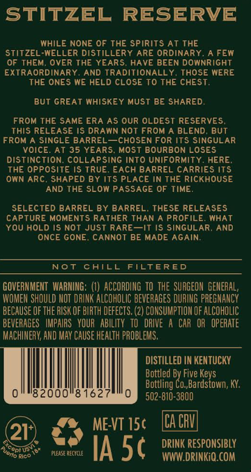
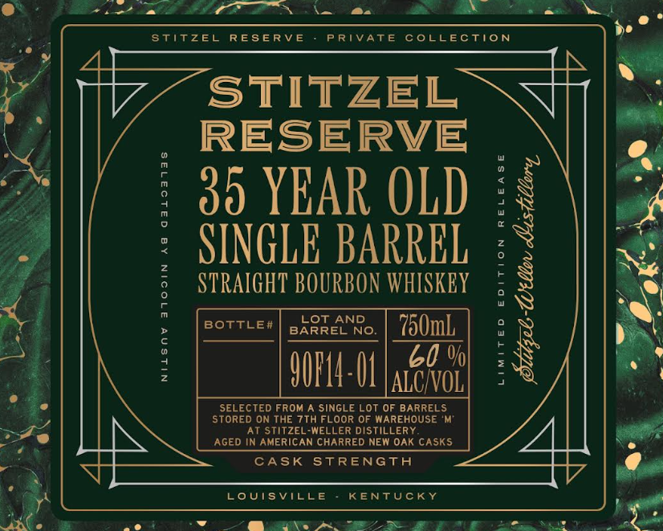

# TTB COLA Label Images - TTBID 26231001000573

**Brand Name:** STITZEL RESERVE

**Issue Date:** 08/27/2026

**Origin Code:** 22

**Product Class/Type:** 101

**Source:** [TTB Public COLA Registry](https://ttbonline.gov/colasonline/viewColaDetails.do?action=publicFormDisplay&ttbid=26231001000573)

## Label Images

### Back Label

### Front Label

## Extracted Label Text

*Text extracted via OCR - may contain errors*

**Detected Proof:** 120
**Detected Age:** 35 Years

### Back Label

STITZEL
RESERVE
WHILE NONE 0F THE Spirits AT THE
STITzEL-WELLER DISTILLERY ARE ORDINARY
A FEW
OF THEM
OVER THE YEARS, HAVE BEEN DOWNRIGHT
EXTRAORDINARY
AND TRADITIONALLY
THOSE WERE
THE ONES WE HELD CLOSE To THE CHEST;
BUT GREAT WHISKEY MUST BE SHARED;
FROM THE SAME ERA AS OUR OLDEST RESERVES
THIS RELEASE IS DRAWN NOT FROM
BLEND
BUT
FROM A SINGLE BARREL
CHOSEN FOR ITS SINGULAR
VOIcE. AT 35 YEARS
MOST BOURBON LOSES
distinction; COLLAPSING INTO UNIFORMITY. HERE
THE OPPOSITE IS TRUE. EACH BARREL CARRIES ITS
OWN
ARC
SHAPED BY ITS PLACE IN THE RICKHOUSE
AND THE SLOW PASSAGE OF TIME
SELECTED BARREL BY BARREL. THESE RELEASES
CAPTURE MOMENTS RATHER THAN A PROFILE
WHAT
YOU HOLD IS NOT JUST RARE ~IT IS SINGULAR
AND
ONCE GONE
CANNOT BE MADE AGAIN
Not
CAILL
FILTERED
GOVERNMEHT  WARHING; (1) ACCORDING tO The SURGEON  GeMERAL,
WOMEN SHOULD NOT DRINK ALCOHOLIC beverageS DURING PREGNANCY
BECAUSE OF thE RISK OF BIRTH defects. (2) CONSUMPTLON OF alcoholic
beverAGES   IMPAIRS   VOUR   AbIlITy   TO   DRIVE A CAp   OR   operATe
MACHIMERY; AND MAV Cause HEalTh PROBLEMS,
DISTILLED IN KENTUCKY
Bottled By Five Keys
Bottling Co,Bardstown; KY;
82000"8162
502-810-3800
ME-VT 15c
ICa CV
21
Acopl Us
PLELSE CECICe
IA 5c
DRINK RESPONSIBLY
Rico
WWW DRINKiQ.COM
Jerto F

### Front Label

stitzel
RESERV E
PRTVATE
CoLLECTiON
STITZEL
RESERVE
35 YEAR OLD
:
SINGLE BARREL
2
2
STRAIGHT BOURBON WHISKEY
:
BOTTLE#
BARRELNo:
750mL
0
1
6
60 %
2
9UFL4: OL |alzouol|
;
SELECTED FROM A SINGLE Lot OF BARRELS
StOrED ON THE 7th FLoor 0F MAREHOUSE
At Stitzel-WELLER DISTILLERY
AGEd In American chaRRED NEW OAK casks
CASK
STRENGTh
LoUISVILLE
KENTUCKY
