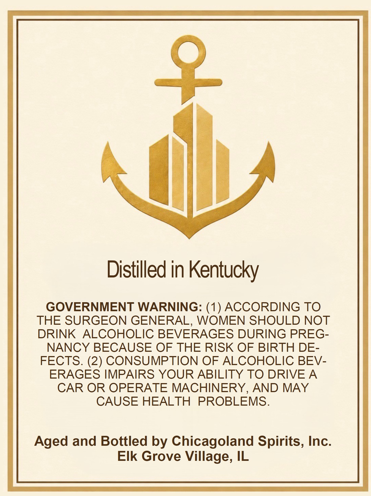
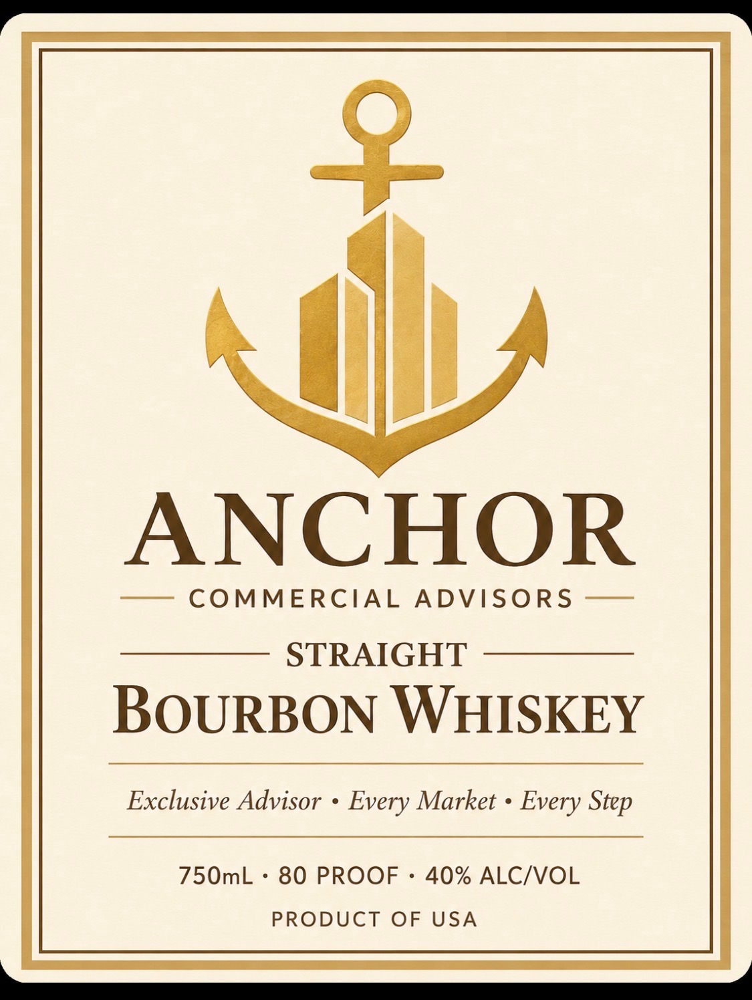

# TTB COLA Label Images - TTBID 26231001000636

**Brand Name:** ANCHOR

**Issue Date:** 08/26/2026

**Origin Code:** 04

**Product Class/Type:** 101

**Source:** [TTB Public COLA Registry](https://ttbonline.gov/colasonline/viewColaDetails.do?action=publicFormDisplay&ttbid=26231001000636)

## Label Images

### Back Label

### Label 1

## Extracted Label Text

*Text extracted via OCR - may contain errors*

**Detected Proof:** 80

### Back Label

Distilled in Kentucky

GOVERNMENT WARNING: (1) ACCORDING TO

THE SURGEON GENERAL, WOMEN SHOULD NOT

DRINK ALCOHOLIC BEVERAGES DURING PREG-

NANCY BECAUSE OF THE RISK OF BIRTH DE-

FECTS. (2) CONSUMPTION OF ALCOHOLIC BEV-

ERAGES IMPAIRS YOUR ABILITY TO DRIVE A

CAR OR OPERATE MACHINERY, AND MAY

CAUSE HEALTH PROBLEMS.

Aged and Bottled by Chicagoland Spirits, Inc

Elk Grove Village, IL

### Label 1

2
ANCHOR
COMMERCIAL
ADVISORS
STRAIGHT
BOURBON WHISKEY
Exclusive Advisor
Every Market
Every
750mL
80 PROOF
40% ALCIVOL
PRODUCT
OF USA
Step
