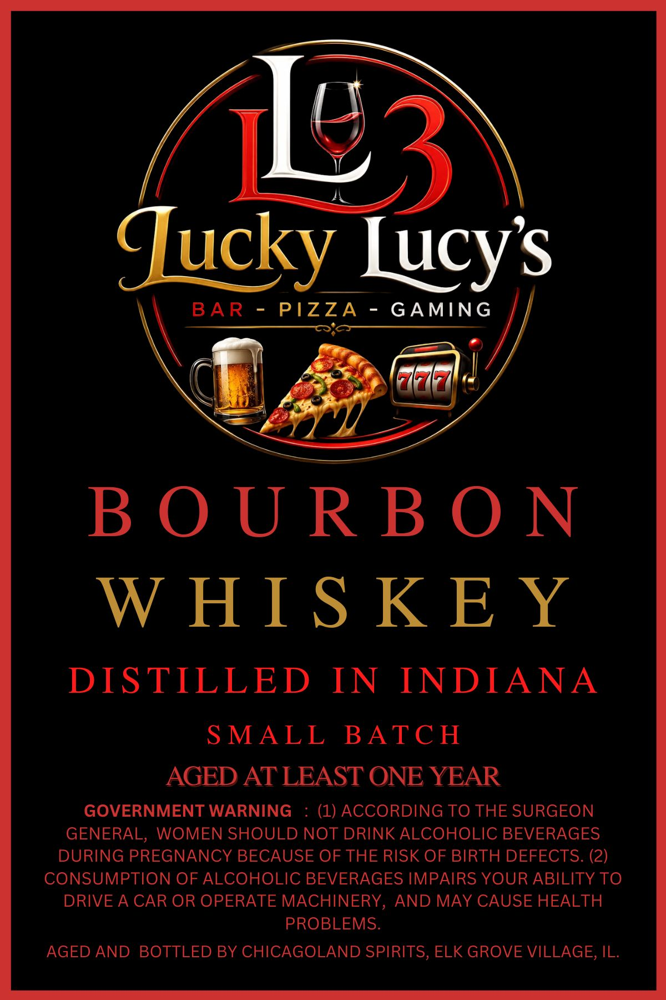
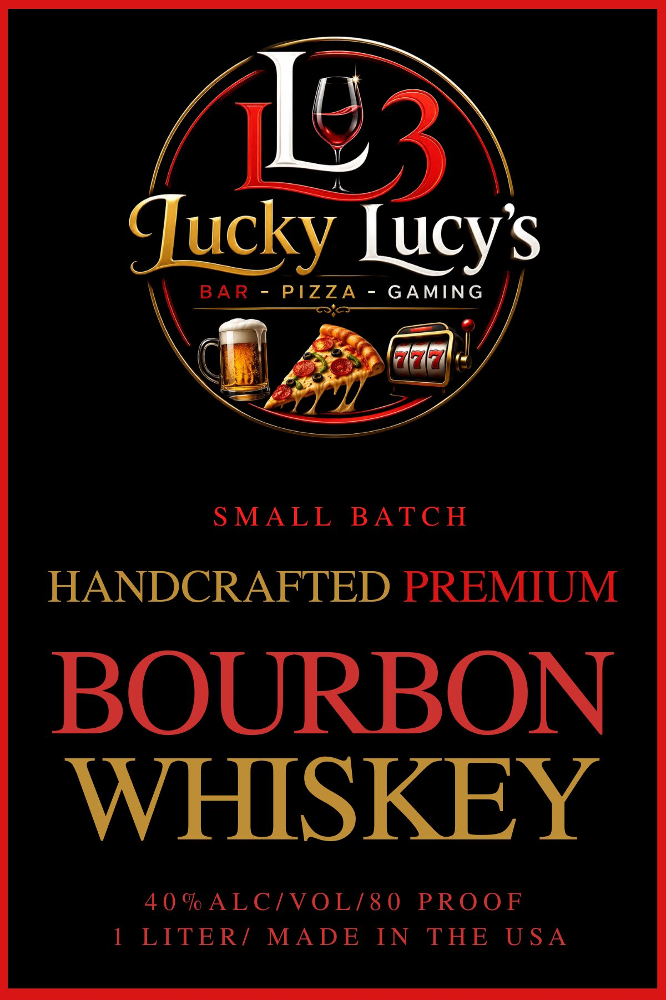

# TTB COLA Label Images - TTBID 26231001000662

**Brand Name:** LUCKY LUCY'S

**Issue Date:** 08/26/2026

**Origin Code:** 04

**Product Class/Type:** 141

**Source:** [TTB Public COLA Registry](https://ttbonline.gov/colasonline/viewColaDetails.do?action=publicFormDisplay&ttbid=26231001000662)

## Label Images

### Back Label

### Front Label

## Extracted Label Text

*Text extracted via OCR - may contain errors*

**Detected Proof:** 80

### Back Label

/

Le

(

g3\

d

lucky

Lucy's

BAR - PIZZA - GAMING

*,

%

\

lon

men

C

W

faa

"i

BOURBON

WHISKEY

DISTILLED IN INDIANA

SMALL BATCH

AGED AT LEAST ONE YEAR

GOVERNMENT WARNING

(1) ACCORDING TO THE SURGEON

GENERAL, WOMEN SHOULD NOT DRINK ALCOHOLIC BEVERAGES

DURING PREGNANCY BECAUSE OF THE RISK OF BIRTH DEFECTS. (2)

CONSUMPTION OF ALCOHOLIC BEVERAGES IMPAIRS YOUR ABILITY TO

DRIVE A CAR OR OPERATE MACHINERY, AND MAY CAUSE HEALTH

PROBLEMS.

AGED AND BOTTLED BY CHICAGOLAND SPIRITS, ELK GROVE VILLAGE, IL.

### Front Label

(13

ducky ucy’s

BAR PIZZA - GAMING

(een!

«

bat

SMALL BATCH

HANDCRAFTED PREMIUM

BOURBON

WHISKEY

40% ALC/VOL/80 PROOF

1 LITER/ MADE IN THE USA
