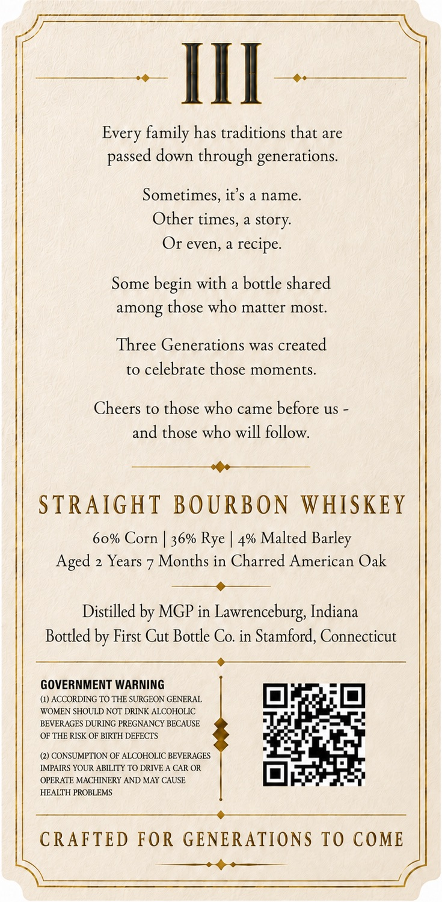
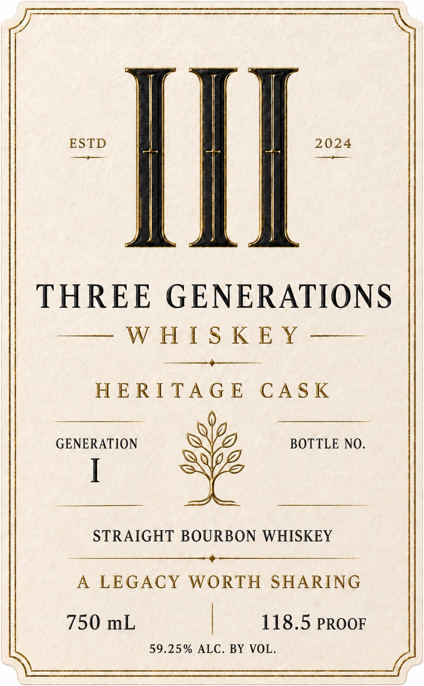

# TTB COLA Label Images - TTBID 26231001000730

**Brand Name:** III THREE GENERATIONS WHISKEY

**Fanciful Name:** HERITAGE CASK

**Issue Date:** 08/26/2026

**Origin Code:** 14

**Product Class/Type:** 101

**Source:** [TTB Public COLA Registry](https://ttbonline.gov/colasonline/viewColaDetails.do?action=publicFormDisplay&ttbid=26231001000730)

## Label Images

### Back Label

### Front Label

## Extracted Label Text

*Text extracted via OCR - may contain errors*

**Detected Proof:** 118.5

### Back Label

III
Every family has traditions that are
down through generations_
Sometimes, it'$ a name
Other times, a story:
Or even,
Some
begin with a bottle shared
among those who matter most_
Three Generations was created
to celebrate those moments_
Cheers to those who came before us
and those who will follow.
STRAIGHT BOURBON
WHISKEY
60% Corn
36% Rye
4% Malted
Aged
Years
Months in Charred American Oak
Distilled by MGP in Lawrenceburg, Indiana
Bottled by First Cut Bottle Co. in Stamford, Connecticut
GOVERNMENT WARNING
(4) ACCORDING TO THE SURGEON GENERAL
WOMEN SHOULD NOT DRINK ALCOHOLIC
BEVERAGES DURING PREGNANCY BECAUSE
OF THE RISK OF BIRTH DEFECTS
(2) CONSUMPTION OF ALCOHOLIC BEVERAGES
IMPAIRS YOUR ABILITY TO DRIVE A CAR OR
OPERATE MACHINERY AND MAY CAUSE
HEALTH PROBLEMS
CRAFTED FOR GENERATIONS TO COME
passed
recipe.
Barley

### Front Label

Ill

THREE GENERATIONS

oe NNO Ae EY re

HERITAGE CASK

GENERATION

BOTTLE NO.

|

STRAIGHT BOURBON WHISKEY

——-

A LEGACY WORTH SHARIN

750 mL

118.5 PROOF

59.25% ALC. BY VOL.
