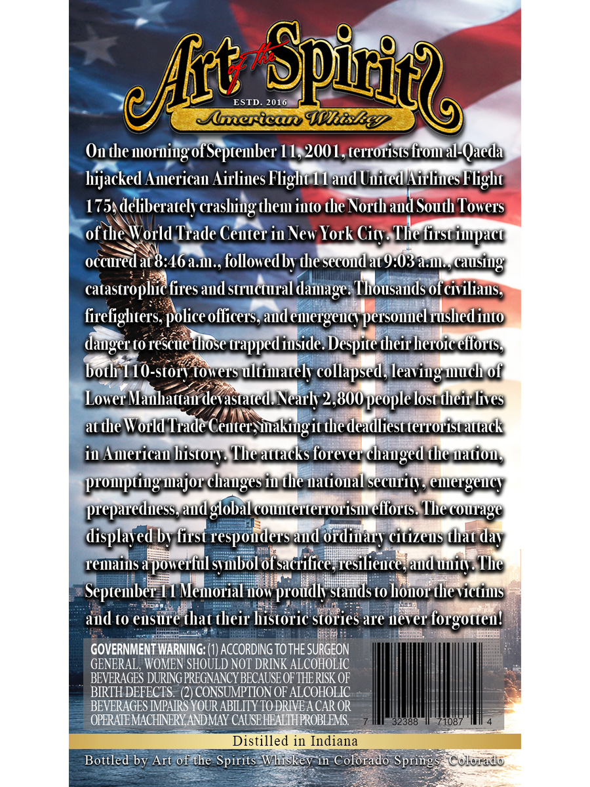
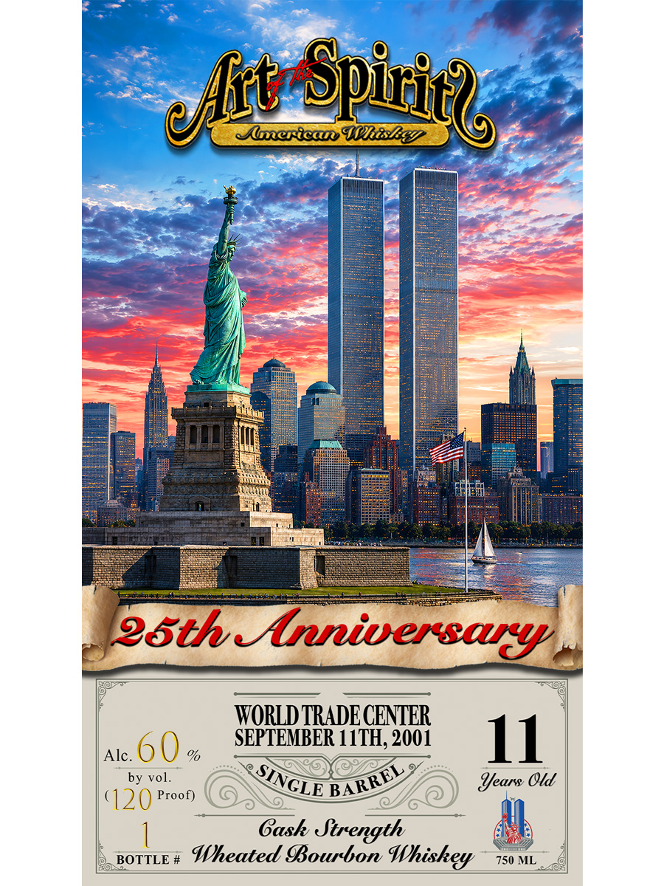

# TTB COLA Label Images - TTBID 26231001000796

**Brand Name:** ART OF THE SPIRITS AMERICAN WHISKEY

**Fanciful Name:** TWIN TOWERS

**Issue Date:** 08/26/2026

**Origin Code:** 13

**Product Class/Type:** 101

**Source:** [TTB Public COLA Registry](https://ttbonline.gov/colasonline/viewColaDetails.do?action=publicFormDisplay&ttbid=26231001000796)

## Label Images

### Back Label

### Front Label

## Extracted Label Text

*Text extracted via OCR - may contain errors*

**Detected Proof:** 120

### Back Label

ESTD
~Spinice
2016
leerical HhisEey
Ou themoruing ofSeprember 11,2001, terrorists fiom al-Qaeda
hijacked American Airlines Flight / L aud Uuited Hirliues Flight
175Adeliberately crashiug them iuto the North and South Towers
ofthe World Trade Center in New York Cicy The dirst impact
occured at 8.46a.11., followedbv dhe sccoud ac9.03a.11:, (usiug
catastrophic fires andstructural daage: Thousands ofcivilianss
firelighters;
'officers, and emergency personnel rushed into
danger to rescuethose
trapped iuside Despite theirheroiceltons
both T10-storv towers ultimatel collapsed,
leaving uuch of
LowerManhattau devastated Nearh 2,800 peoplelost theirlives
atthe World Trade Ceuter inakingit thedeadliest terTorist ateack
in American history: The attacks forever changed the uatiou;
prompting uajor chauges in the Hatioual securitys emergeucy
prepareduess, audglobal couuterterTorisu efforts. Thecourage
displaved by first respouders aud ordiuary citizeus that
Temaius
apowerful subol of sacrifice'vesilience]aud uuity. The
Septembei I1 Memorial uow proudh stauds to honor thevictins
aud to ensure that their historic stories are never forgoteu!
GOVERNMENT WARNING: (1) ACCORDING TOTHE SURGEON
GENERAL , WOMEN SHOULD NOT DRINK ALCOHOLIC
BEVERAGES DURING PREGNANCY BECAUSE OF THE RISK OF
BIRTH DEFECTS . (2) CONSUMPTION OF ALCOHOLIC
BEVERAGES IMPAIRS YOUR ABILITY TO DRIVEA CAR OR
OPERATEMACHINERY ANDMAY CAUSEHFALTHPROBLEMS
32388
71087
Distilled in Indiana
Bottled by Art of the Spirits Whiskey in Colorado Springs
Colorado
eJfhi
police (
day

### Front Label

Aluerican
~Spiniel
SLihez
g5th-Anniversas
WORLD TRADE CENTER
SEPTEMBER 11TH, 2001
11
Alc_
%f
by vol.
ears Old
'120
Proof)
Gask Strength
BOTTLE #
Wheated IBourbon Whiskey
750 ML
eflit
SINGLE
BARREL
