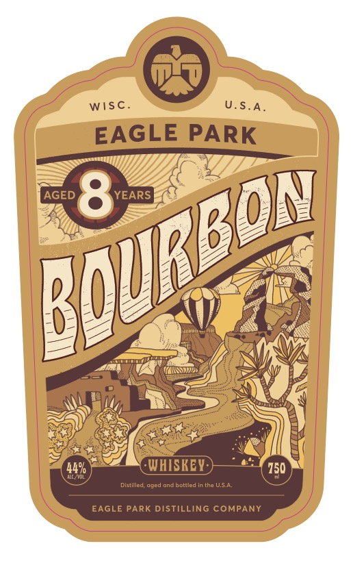
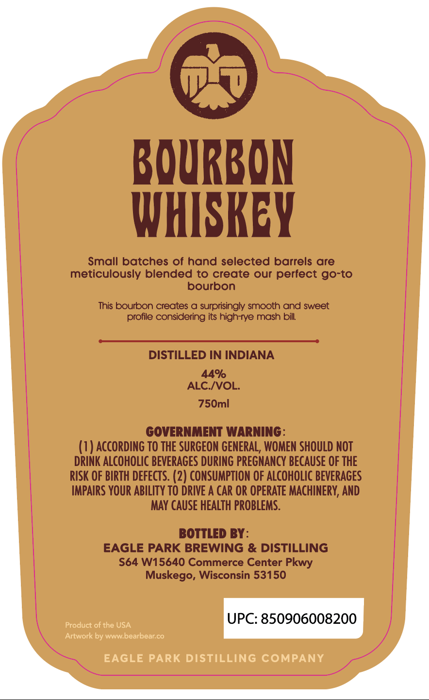

# TTB COLA Label Images - TTBID 26231001000862

**Brand Name:** EAGLE PARK

**Issue Date:** 09/01/2026

**Origin Code:** 48

**Product Class/Type:** 141

**Source:** [TTB Public COLA Registry](https://ttbonline.gov/colasonline/viewColaDetails.do?action=publicFormDisplay&ttbid=26231001000862)

## Label Images

### Label 1

### Label 2

## Extracted Label Text

*Text extracted via OCR - may contain errors*

**Detected Proof:** 88
**Detected Age:** 8 Years

### Label 1

Wisc_
U.S.A_
EAGLE PARK
AGED
8
YEARS
449
WHISKEY
150
Distillcd; agcd ondBottled in thc USA
EAGLE PARK DISTILLING COMPANY
Bgurbon

### Label 2

BQURBON
WHISKEY
Small batches of hand selected barrels are
meticulously blended to create our perfect go-to
bourbon
This bourbon creates
surprisingly smooth and sweet
profile considering its high-rye mash bill:
DISTILLED IN INDIANA
44%
ALC_NVOL:
750ml
GOVERNMENT WARNING:
(1) AccoRdinG To THE SURGEON GENERAL, WOMEN SHOULD NOT
DRINK ALCOHOLIC bevERAGES DURING PREGNANCY BECAUSE OF THE
RISK OF BIRTH DEFECTS. (2) CONSUMPTION OF ALcoHOLIc BEVERAGES
IMPAIRS YOUR ABILITy TO DRIVE A CAR OR OPERATE MACHINERV, AND
MAY CAUSE HEALTH pROBLEMS.
BOTTLED BY:
EAGLE PARK BREWING & DISTILLING
S64 W15640 Commerce Center
Muskego, Wisconsin 53150
Product of the USA
UPC: 850906008200
Artwork by wwwbearbear co
EAGLE PARK DISTILLING COMPANY
Pkwy
