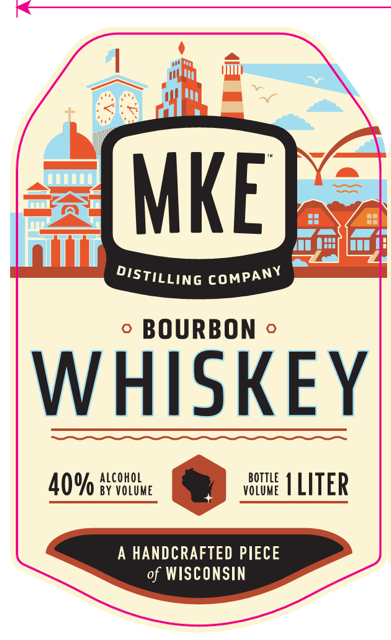
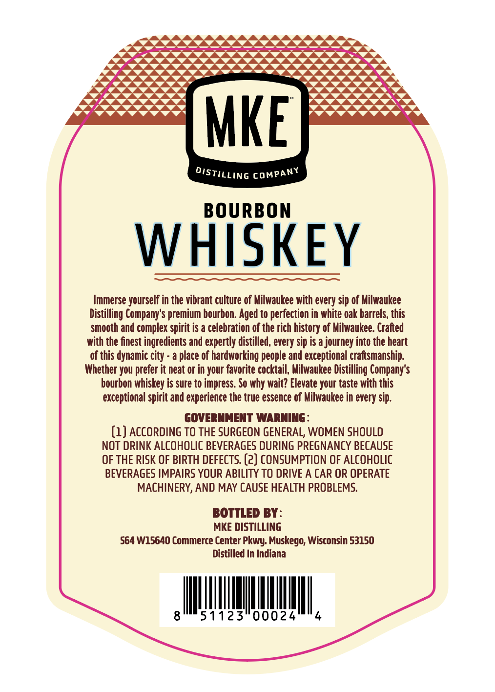

# TTB COLA Label Images - TTBID 26231001000863

**Brand Name:** MKE DISTILLING COMPANY

**Issue Date:** 09/02/2026

**Origin Code:** 48

**Product Class/Type:** 141

**Source:** [TTB Public COLA Registry](https://ttbonline.gov/colasonline/viewColaDetails.do?action=publicFormDisplay&ttbid=26231001000863)

## Label Images

### Label 1

### Label 2

## Extracted Label Text

*Text extracted via OCR - may contain errors*

### Label 1

D

ty)

—{\—

*

i

DISTILLING COMPANY

o BOURBON ©

WHISKEY

ALCOHOL

BOTTLE

40% Hiitiue

BY VOLUME

VOLUME

ILITER

Gam

A HANDCRAFTED PIECE

of WISCONSIN

### Label 2

MKE
BOURBON
WHISKEY
Immerse yourself in the vibrant culture of Milwaukee with every sip of Milwaukee
Distilling Company'$ premium bourbon. Aged to perfection in white oak barrels, this
smooth and complex spirit is a celebration of the rich history of Milwaukee. Crafted
with the finest ingredients and expertly distilled, every sip is a journey into the heart
of this dynamic
place of hardworking people and exceptional craftsmanship:
Whether you
it neat or in your favorite cocktail, Milwaukee Distilling Company's
bourbon whiskey is sure to impress: So why wait? Elevate your taste with this
exceptional spirit and experience the true essence of Milwaukee in every sip:
GOVERNMENT WARNING
(1) ACCORDING TO THE SURGEON GENERAL; WOMEN SHOULD
NOT DRINK ALCOHOLIC BEVERAGES DURING PREGNANCY BECAUSE
OF THE RISK OF BIRTH DEFECTS. (2) CONSUMPTION OF ALCOHOLIC
BEVERAGES IMPAIRS YOUR ABILITY TO DRIVE A CAR OR OPERATE
MACHINERY, AND MAY CAUSE HEALTH PROBLEMS:
BOTTLED BY:
MKE DISTILLING
564 W15640 Commerce Center
Muskego; Wisconsin 53150
Distilled In Indiana
51123"00024
Distilling
COMPANY
city ~
prefer [
Pkwy:
