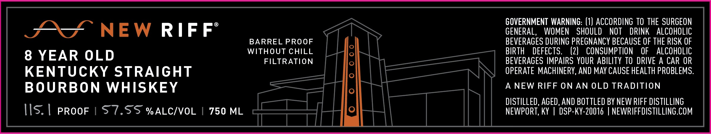

# TTB COLA Label Images - TTBID 26232001000043

**Brand Name:** NEW RIFF

**Issue Date:** 08/26/2026

**Origin Code:** 22

**Product Class/Type:** 101

**Source:** [TTB Public COLA Registry](https://ttbonline.gov/colasonline/viewColaDetails.do?action=publicFormDisplay&ttbid=26232001000043)

## Label Images

### Front Label

## Extracted Label Text

*Text extracted via OCR - may contain errors*

**Detected Age:** 8 Years

### Front Label

GOVERNMENT WARNING: (1) ACCORDING TO THE SURGEON

AS NEW RIFF

GENERAL, WOMEN SHOULD NOT DRINK ALCOHOLIC

BARREL PROOF

BEVERAGES DURING PREGNANCY BECAUSE OF THE RISK OF

8 YEAR OLD

WITHOUT CHILL

BIRTH DEFECTS.

(2) CONSUMPTION OF ALCOHOLIC

FILTRATION

BEVERAGES IMPAIRS YOUR ABILITY TO DRIVE A CAR OR

KENTUCKY STRAIGHT

OPERATE MACHINERY, AND MAY CAUSE HEALTH PROBLEMS

BOURBON WHISKEY

A NEW RIFF ON AN OLD TRADITION

DISTILLED, AGED, AND BOTTLED BY NEW RIFF DISTILLING

\|S. | pRooF | S7.SS %ALC/VOL | 750 ML

aril

NEWPORT, KY | DSP-KY-20016 | NEWRIFFDISTILLING.COM

YT Td

HAE

Nem
