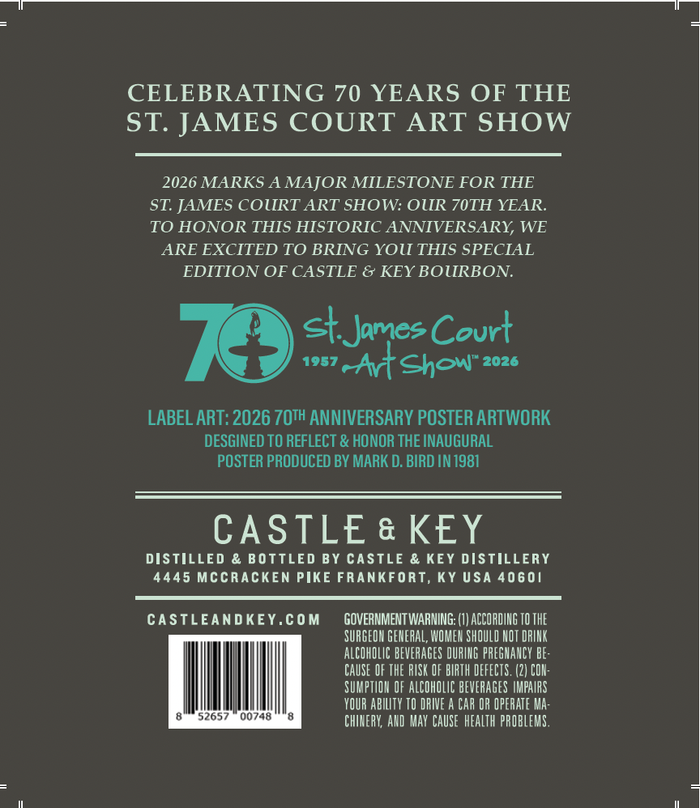
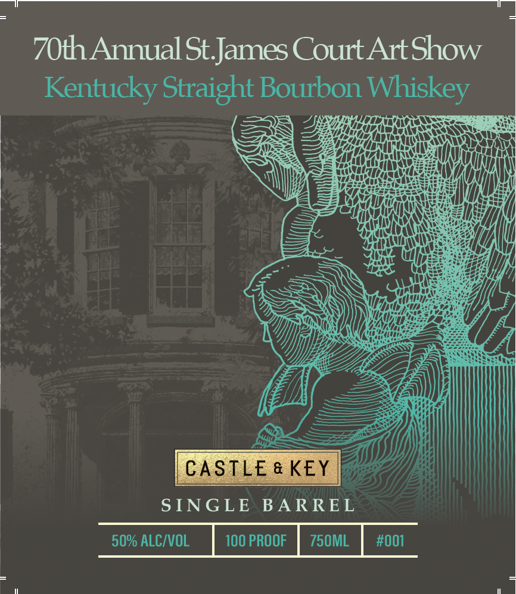
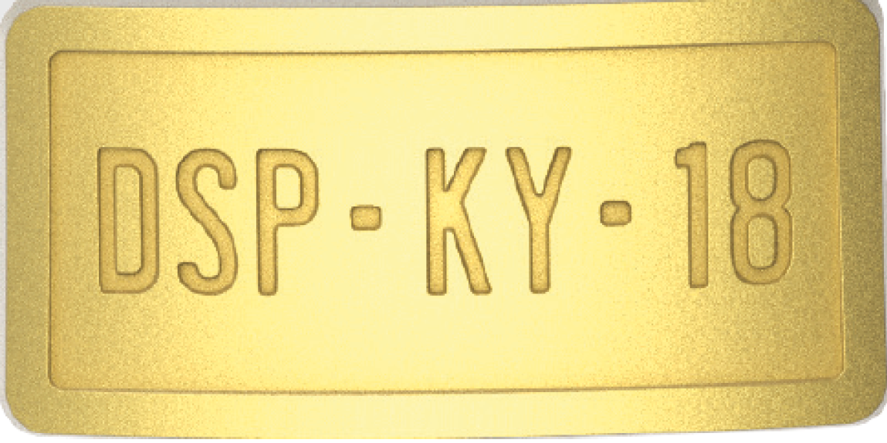

# TTB COLA Label Images - TTBID 26232001000051

**Brand Name:** CASTLE & KEY

**Fanciful Name:** 70TH ANNUAL ST. JAMES COURT ART SHOW

**Issue Date:** 08/26/2026

**Origin Code:** 22

**Product Class/Type:** 101

**Source:** [TTB Public COLA Registry](https://ttbonline.gov/colasonline/viewColaDetails.do?action=publicFormDisplay&ttbid=26232001000051)

## Label Images

### Back Label

### Front Label

### Label 3

### Label 4

## Extracted Label Text

*Text extracted via OCR - may contain errors*

*2 image(s) excluded: text did not meet readability threshold*

**Detected Proof:** 100

### Back Label

CELEBRATING 70 YEARS OF THE
ST: JAMES COURT
ART SHOW
2026 MARKS A MAJOR MILESTONE FOR THE
ST: JAMES COURT ART SHOW: OUR 70TH YEAR.
TO HONOR THIS HISTORIC ANNIVERSARY, WE
ARE EXCITED TO BRING YOU THIS SPECIAL
EDITION OF CASTLE & KEY BOURBON:
StJames Court
1957
~Atshow"
2026
LABEL ART: 2026 ZOTH ANNIVERSARY POSTER ARTWORK
DESGINED TO REFLECT & HONOR THE INAUGURAL
POSTER PRODUCED BY MARK D. BIRD IN 1981
CASTLE & KEY
DISTILLED & BOTTLED BY CASTLE & KEY DISTILLERY
4445 Mccracken PIkE FRAnKFORT, KY Usa 40601
CAStLEANDKEY.com
GOVERNMENT WARNING:
ACCORDING TO THE
SURGEOH GEHERAL, WOMEH SHOULD NOT DRINK
ALCOHOLIC BEVERAGES DURIG PREGHANCY be:
CAUSE OF THE RISK OF BIRTH DEFECTS,
CON:
SUMPTHOH OF ALCOHOLIC BEVERAGES IMPAIRS
YOUR ABILITY TO DRIVE A CAr OR OPERATE Ma:
52657
00748
CHIHERY; AHD  MaY CAUSE  HEALTh PROBLEMS,

### Front Label

70th Annual St.James Court Art Show
Kentucky Straight Bourbon Whiskey

QS, JE See
HE HATTALI ALAC AROS RS
SIGNS SY

if a)

ANH i| vault
ae ALANA
Hh

SINGLE BARREL

50% ALC/VOL 100 PROOF | 750ML | #001
