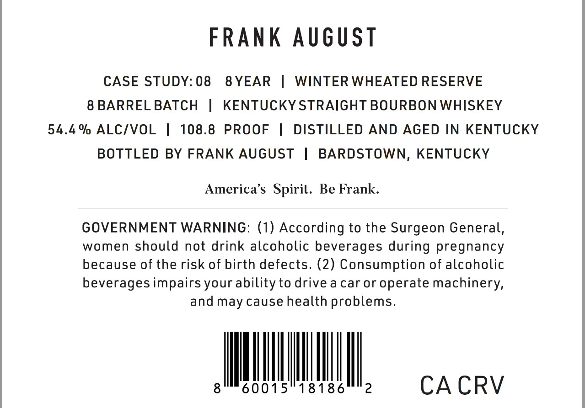
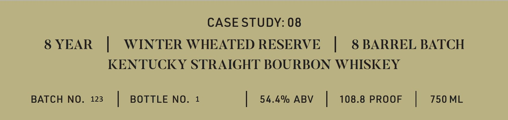

# TTB COLA Label Images - TTBID 26232001000079

**Brand Name:** FRANK AUGUST

**Issue Date:** 08/26/2026

**Origin Code:** 22

**Product Class/Type:** 101

**Source:** [TTB Public COLA Registry](https://ttbonline.gov/colasonline/viewColaDetails.do?action=publicFormDisplay&ttbid=26232001000079)

## Label Images

### Back Label

### Label 1

## Extracted Label Text

*Text extracted via OCR - may contain errors*

**Detected Proof:** 108.8
**Detected Age:** 8 Years

### Back Label

FRAnK August
CASE STUDY: 08
8 YEAR
WINTER WHEATED RESERVE
8 BARREL BATCH
KENTUCKY STRAIGHT BOURBON WHISKEY
54.4 % ALCIVOL
108.8
PROOF
DISTILLED AND AGED IN KENTUCKY
BOTTLED BY FRANK AUGUST
BARDSTOWN, KENTUCKY
America's  Spirit: Be Frank.
GOVERNMENT WARNING: (1) According to the Surgeon General,
women should not drink alcoholic beverages during pregnancy
because of the risk of birth defects. (2) Consumption of alcoholic
beverages impairs your ability to drive a caror operate machinery,
and may cause health problems.
8
60015
18186
2
CA CRV

### Label 1

CASE STUDY: 08
8 YEAR
WINTER WHEATED RESERVE
8 BARREL BATCH
KENTUCKY STRAIGHT BOURBON WHISKEY
BATCH NO.
123
BOTTLE NO_
54.4% ABV
108.8 PROOF
750 ML
