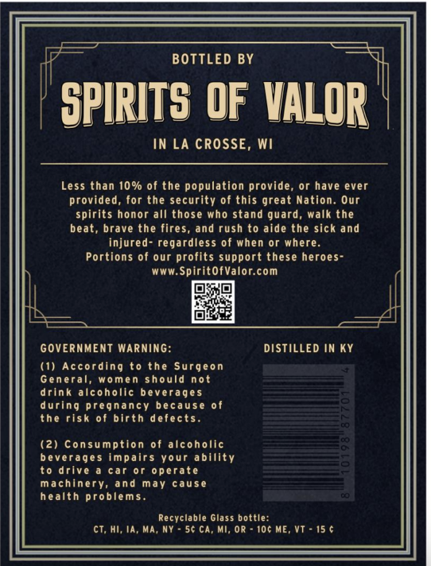
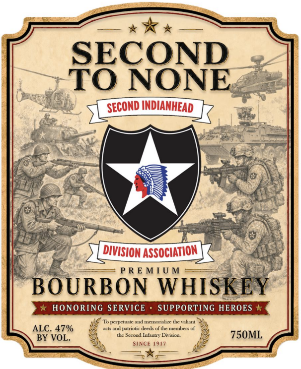

# TTB COLA Label Images - TTBID 26232001000172

**Brand Name:** SECOND INDIANHEAD DIVISION ASSOCIATION

**Issue Date:** 08/27/2026

**Origin Code:** 48

**Product Class/Type:** 141

**Source:** [TTB Public COLA Registry](https://ttbonline.gov/colasonline/viewColaDetails.do?action=publicFormDisplay&ttbid=26232001000172)

## Label Images

### Back Label

### Front Label

## Extracted Label Text

*Text extracted via OCR - may contain errors*

### Back Label

BOTTLED BY
SPIRITS OF VALOR
IN LA CROSSE, Wi
Less than 10% of the population provide
or have ever
provided, for the security of this great Nation. Our
spirits honor all those who stand guard_
walk the
beat, brave
fires, and rush to aide the sick and
injured- regardless of when or where.
Portions of our profits support these heroes-
WwW.SpiritofValor com
GOVERNMENT Warning:
DISTILLED IN Ky
(1) According to the Surgeon
General,
women
should
not
drink
alcoholic beverages
during pregnancy because
the risk of birth defects.
(2) Consumption of alcoholic
beverages impairs Your ability
t0 drive
car 0r operate
machinery, and
may
cause
health problems.
Recyclable Glass bottle:
ct; Hi; ia, Ma,
5 ca, Mi; Or
10c ME,
Vt - 15 (
the

### Front Label

SECOND
TO NONE
SECOND INDIANHEAD
DIVISION ASSOCIATION
P R E M [ U M
BOURBON
WHISKEY
HONORING SERVICE
SUPPORTING HEROES *
To papctualc aud mctorlizc tlc Valiaut
ALC. 47%
ncts and patriotic dcds ofthe mcmbers of
BY VOL.
Sccoud Iufanty Diiston
750ML
SINCE [9[7
