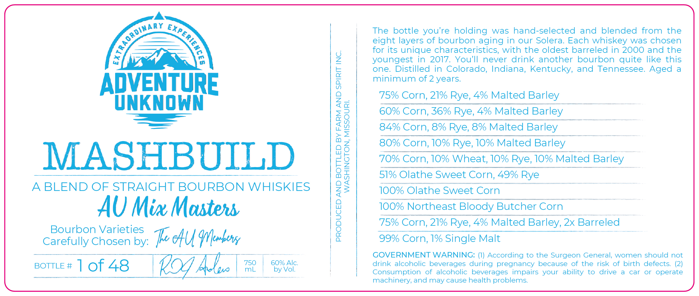

# TTB COLA Label Images - TTBID 26232001000186

**Brand Name:** MASHBUILD

**Issue Date:** 09/16/2026

**Origin Code:** 29

**Product Class/Type:** 121

**Source:** [TTB Public COLA Registry](https://ttbonline.gov/colasonline/viewColaDetails.do?action=publicFormDisplay&ttbid=26232001000186)

## Label Images

### Label 1

## Extracted Label Text

*Text extracted via OCR - may contain errors*

**Detected Age:** 2 Years

### Label 1

AUNKNGHN

—

—=—

MASHBUILD

A BLEND OF STRAIGHT BOURBON WHISKIES
AU Mix Masters
Bourbon Varieti
Carefully chosen by: MAL (Member
comes 10f48 | KOT AL. | | itt

PRODUCED AND BOTTLED BY FARM AND SPIRIT INC.
WASHINGTON, MISSOURI.

The bottle you’re holding was hand-selected and blended from the
eight layers of bourbon aging in our Solera. Each whiskey was chosen
for its unique characteristics, with the oldest barreled in 2000 and the
youngest in 2017. You'll never drink another bourbon quite like this
one. Distilled in Colorado, Indiana, Kentucky, and Tennessee. Aged a
minimum of 2 years.

75% Corn, 21% Rye, 4% Malted Barley

60% Corn, 36% Rye, 4% Malted Barley

84% Corn, 8% Rye, 8% Malted Barley

80% Corn, 10% Rye, 10% Malted Barley

70% Corn, 10% Wheat, 10% Rye, 10% Malted Barley _

51% Olathe Sweet Corn, 49% Rye :

100% Olathe Sweet Com —t—~tS

100% Northeast Bloody Butcher Corn

75% Corn, 21% Rye, 4% Malted Barley, 2x Barreled

99% Corn, 1% Single Malt -
GOVERNMENT WARNING: (1) According to the Surgeon General, women should not
drink alcoholic beverages during pregnancy because of the risk of birth defects. (2)

Consumption of alcoholic beverages impairs your ability to drive a car or operate
machinery, and may cause health problems.
