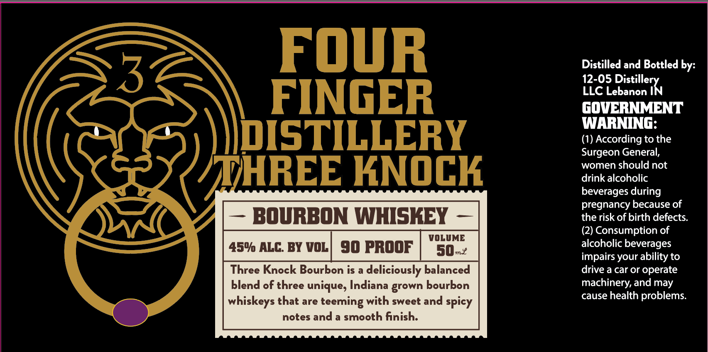

# TTB COLA Label Images - TTBID 26232001000187

**Brand Name:** FOUR FINGER DISTILLERY

**Fanciful Name:** THREE KNOCK BOURBON WHISKEY

**Issue Date:** 08/31/2026

**Origin Code:** 19

**Product Class/Type:** 141

**Source:** [TTB Public COLA Registry](https://ttbonline.gov/colasonline/viewColaDetails.do?action=publicFormDisplay&ttbid=26232001000187)

## Label Images

### Label 1

## Extracted Label Text

*Text extracted via OCR - may contain errors*

**Detected Proof:** 90

### Label 1

FOUR
Distilled and Bottled by:
12-05
FINGER
LLC Lebanon
gOVERNMENT
WARNING:
DISTILLERY
(1) According to the
Surgeon General;
women should not
HREE KNOCK
drink alcoholic
beverages during
pregnancy because of
BOURBON WHISKEY
the risk of birth defects.
(2) Consumption of
VOLUME
450 ALC: BY VOL
90 PROOF
s0m2
alcoholic beverages
impairs your ability to
Three Knock Bourbon is
deliciously balanced
drive a car or operate
blend of three unique; Indiana grown bourbon
machinery; and may
whiskeys that are teeming with sweet and spicy
cause health problems:
notes and a smooth finish:
Distie}v
