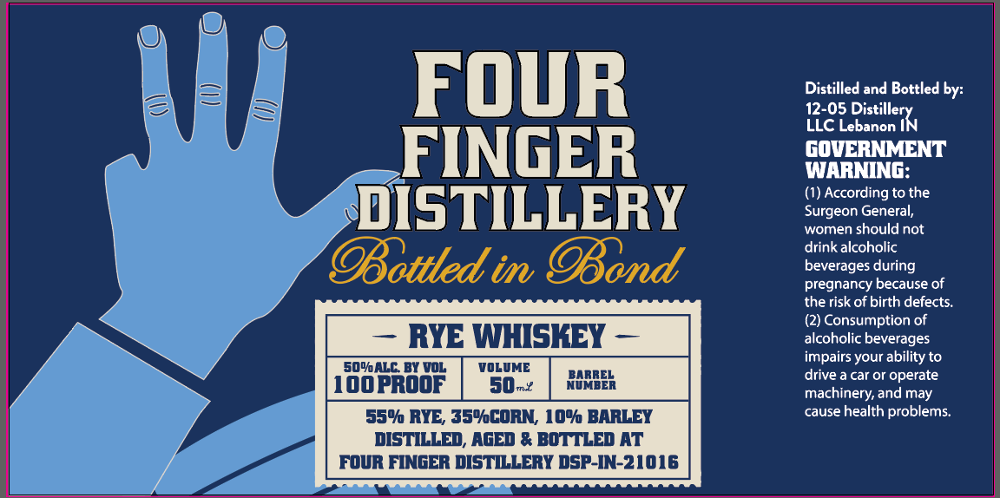

# TTB COLA Label Images - TTBID 26232001000210

**Brand Name:** FOUR FINGER DISTILLERY

**Fanciful Name:** BOTTLED IN BOND RYE WHISKEY

**Issue Date:** 08/31/2026

**Origin Code:** 19

**Product Class/Type:** 112

**Source:** [TTB Public COLA Registry](https://ttbonline.gov/colasonline/viewColaDetails.do?action=publicFormDisplay&ttbid=26232001000210)

## Label Images

### Label 1

## Extracted Label Text

*Text extracted via OCR - may contain errors*

### Label 1

FOuR
Distilled and Bottled by:
12-05
LLC Lebanon
FINGER
GOVERNMENT
WARNING:
(1) According to the
DISTILLERY
Surgeon General;
women
should not
drink alcoholic
OBottted im OBond
beverages during
pregnancy because of
the risk of birth defects_
(2) Consumption of
RYE WHISKEY
alcoholic beverages
impairs your ability to
so0alC BY voL
VOLUME
HHNEE
drive a car or operate
IOOPrOOF
50-X
machinery, and may
559@ RYE, 354CORN, 109k BARLEY
cause health problems:
DISTILLED, AGED & BOTTLED AT
FOUR FINGER DISTILLERY DSP-IN-21016
DistillerXv
