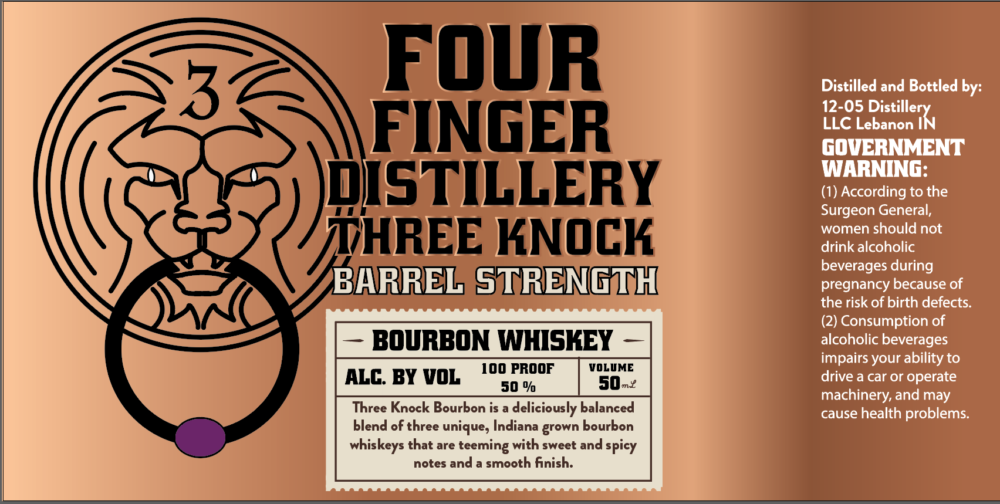

# TTB COLA Label Images - TTBID 26232001000214

**Brand Name:** FOUR FINGER DISTILLERY

**Fanciful Name:** THREE KNOCK BARREL STRENGTH BOURBON WHISKEY

**Issue Date:** 09/02/2026

**Origin Code:** 19

**Product Class/Type:** 141

**Source:** [TTB Public COLA Registry](https://ttbonline.gov/colasonline/viewColaDetails.do?action=publicFormDisplay&ttbid=26232001000214)

## Label Images

### Label 1

## Extracted Label Text

*Text extracted via OCR - may contain errors*

**Detected Proof:** 100

### Label 1

FouR
Distilled and Bottled by:
12-05 Distillery
FINGER
LLC Lebanon IN
gOVERNMENT
WARNING:
@ISTILLERY
(1) According to the
Surgeon General,
women should not
TTHREE KNOCK
drink alcoholic
beverages during
BHRREL STRENGTH
pregnancy because of
the risk of birth defects:
(2) Consumption of
BOURBON WHISKEY
alcoholic beverages
impairs your ability to
100 PROOF
VOLUME
ALC BY VOL
50-2
drive a car or
operate
50 %
machinery, and may
Knock Bourbon is a
deliciously balanced
cause health problems:
blend of three unique; Indiana
bourbon
whiskeys that are
with sweet and
spicy
notes and a smooth finish:
Three
grown
teeming
