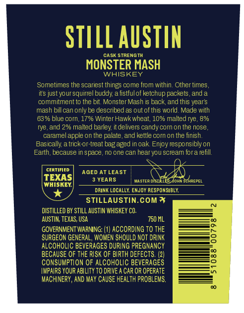
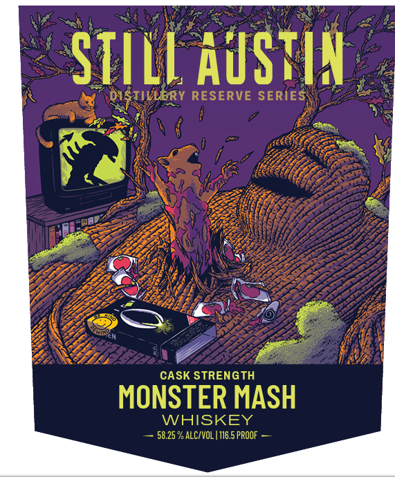

# TTB COLA Label Images - TTBID 26232001000236

**Brand Name:** STILL AUSTIN WHISKEY

**Fanciful Name:** DISTILLERY RESERVE SERIES

**Issue Date:** 08/26/2026

**Origin Code:** 44

**Product Class/Type:** 140

**Source:** [TTB Public COLA Registry](https://ttbonline.gov/colasonline/viewColaDetails.do?action=publicFormDisplay&ttbid=26232001000236)

## Label Images

### Back Label

### Front Label

### Label 3

## Extracted Label Text

*Text extracted via OCR - may contain errors*

**Detected Proof:** 116.5

### Back Label

STILL AuSTIN
CASK STRENGTH
MONSTER MASH
WHISKEY
Sometimes the scariest things come from within. Other times
its justyour squirrel buddy; a fistfulof ketchup packets, and a
commitment to the bit Monster Mash i back, and this years
mash bill can only be describeda5 out ofthis world. Made with
63% blue corn; 17% Winter Hawkwheat; 10% malted rye , 8%
and 2% malted barley itdelivers candy corn on the nose_
caramel apple on the palate, and kettle corn on the Iinish
Basically atrick-or-treat bagaged in oak Enjoy responsibly on
Earth, because In space_
no one can hearyou scream fora refill:
cerTIfied
AGED AT LEAST
TEXAS
YEARS
aftea misaR onethpePEL
WHISKEY
DRINK Locally, EnJOy RESPONSIBLY,
STILLAUSTIN.COM *
DISTILLED BY STILL AUSTIN WHISKEY Co:
AUSTIN; TEXAS; USA
750 ML
GOVERNMENT WARNING: (1} ACCORDING TO THE
SURGEON GENERAL , WOMEN SHOULD NOT DRLNK
3
ALCOHOLIC BEVERAGES DURING PREGNANCY
BECAUSE OF THE RISK OF BIRTH DEFECTS. (2)
8
Consumption OF ALCOHOLIC BEVERAGES
IMPAIRS YOUR ABILITY TO DRIVE A CAR OR OPERATE
MACHINERY, AND May CAUSE HEALTH PROBLEMS,

### Front Label

STILL AuStIY
TIERY RESERVE SERIES
CASK STRENGTH
MONSTER MASH
WHISKEY
58.25 % ALC/VOL | 116.5 PROOF

### Label 3

DISTILLERY RESERVE SERIES

SIlYIS JAUISIN AYATTILSIO
