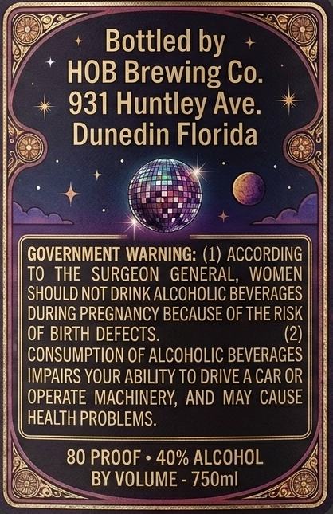
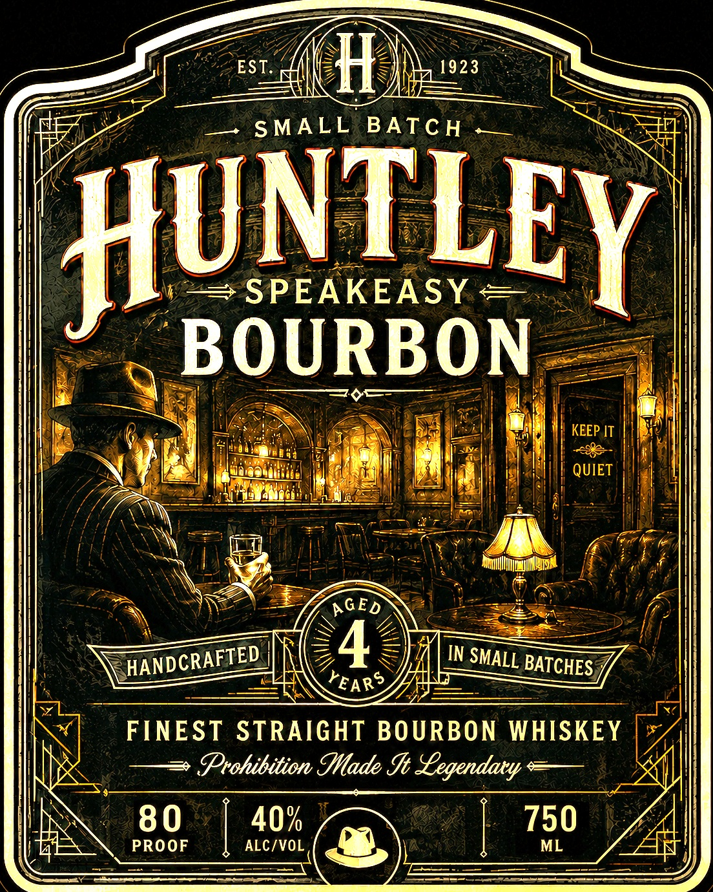

# TTB COLA Label Images - TTBID 26232001000285

**Brand Name:** HUNTLEY SPEAKEASY BOURBON

**Issue Date:** 08/26/2026

**Origin Code:** 16

**Product Class/Type:** 101

**Source:** [TTB Public COLA Registry](https://ttbonline.gov/colasonline/viewColaDetails.do?action=publicFormDisplay&ttbid=26232001000285)

## Label Images

### Back Label

### Label 1

## Extracted Label Text

*Text extracted via OCR - may contain errors*

**Detected Proof:** 80

### Back Label

Bottled by
HOB Brewing Co.
931 Huntley Ave:
Dunedin Florida
GOVERNMENT WARNING: (1) ACCORDING
TO   THE  SURGEON  GENERAL,
WOMEN
SHOULD NOT DRINK ALCOHOLIC BEVERAGES
DURING PREGNANCY BECAUSE OF THE RISK
OF BIRTH DEFECTS.
(2)
CONSUMPTION OF ALCOHOLIC BEVERAGES
IMPAIRS YOUR ABILITY TO DRIVE A CAR OR
OPERATE MACHINERY, AND MAY CAUSE
HEALTH PROBLEMS.
80 PROOF_
40% ALCOHOL
BY VOLUME - 750ml

### Label 1

EST,
H)
1923
SMALL BATC H
HUNTLEY
SPEAKEAsy =
BOURBON
KEEP IT
QUIET
AGED
4
IN
BATCHES
YEARS
FINEST STRAIGHT BOURBON WHISKEY
Prohibition Made I Yegendaxy
80
40%
750
PROOF
ALC/VOL
ML
HANDCRAFTED
SMALL
