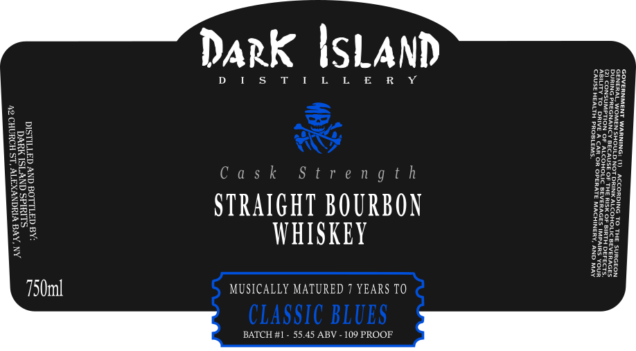

# TTB COLA Label Images - TTBID 26232001000478

**Brand Name:** DARK ISLAND

**Issue Date:** 09/02/2026

**Origin Code:** 02

**Product Class/Type:** 101

**Source:** [TTB Public COLA Registry](https://ttbonline.gov/colasonline/viewColaDetails.do?action=publicFormDisplay&ttbid=26232001000478)

## Label Images

### Label 1

## Extracted Label Text

*Text extracted via OCR - may contain errors*

**Detected Proof:** 109
**Detected Age:** 7 Years

### Label 1

Dark ISLAND

DIS T ILL ER Y
=
&,
D O
WS
Cask Strength

STRAIGHT BOURBON
WHISKEY

MUSICALLY MATURED 7 YEARS TO

CLASSIC BLUES

BATCH #1 - 55.45 ABV - 109 PROOF
