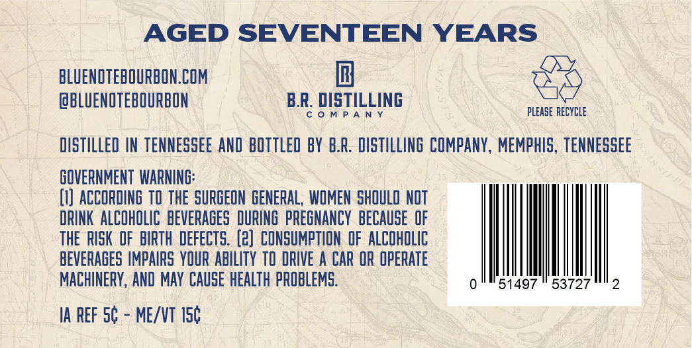
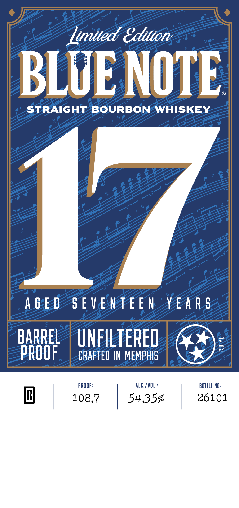

# TTB COLA Label Images - TTBID 26232001000512

**Brand Name:** BLUE NOTE

**Issue Date:** 08/28/2026

**Origin Code:** 43

**Product Class/Type:** 101

**Source:** [TTB Public COLA Registry](https://ttbonline.gov/colasonline/viewColaDetails.do?action=publicFormDisplay&ttbid=26232001000512)

## Label Images

### Back Label

### Front Label

### Label 3

## Extracted Label Text

*Text extracted via OCR - may contain errors*

**Detected Proof:** 108.7

### Back Label

AGED SEVENTEEN YEARS
BLUENOTEBOURBON.COM
@BLUENOTEBOURBON
B.R: DISTILLING
M P A N
please RecyCLe
dIstILLeD IN teNNeSSEE AND  BOTTLeD BY B.R. DISTILLING COMPANY, MEMPHIS, teNNeSSEe
GOVERNMENT  WARNING:
(I] ACCORDINE TO the SURGEON GENERAL, WOMEN shOuLD NOT
DRINK  ALCOHOLIC   beverages DURING pREGNANCY  beCauSe  OF
the  RISK  OF BIRTH  deFecTs. (2]  CONSUMPTION OF AlCOhOLIC
BEVERAGES IMPAIRS YQUR ABILITY T DRIVE A CAR OR OperATe
MACHINERY, AND MaY CAUSE healTh PROBLEMS:
51497
53727
2
IA REF 54
MEIVT I54

### Front Label

Lined Edition

BLUE NOTE

STRAIGHT BOURBON WHISKEY

{/

AGED SEVENTEEN YEARS

BARREL | UNFILTERED

ROOF

CRAFTED IN MEMPHIS

PROOF:

ALC./VOL

BOTTLE NO

Ih} | 108.7

54.35%

26101

### Label 3

[==] 9 + + AGED SEVENTEEN YEARS SUVSA NIHLNNGS O30V x + +  ]
