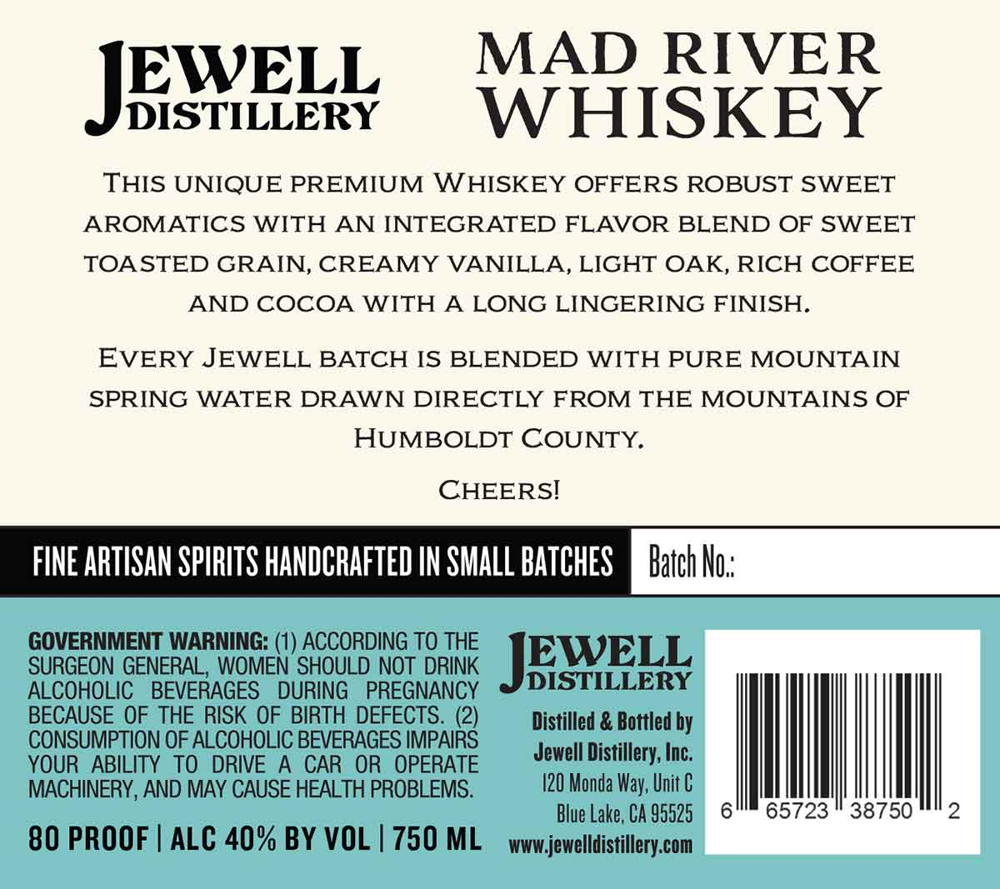
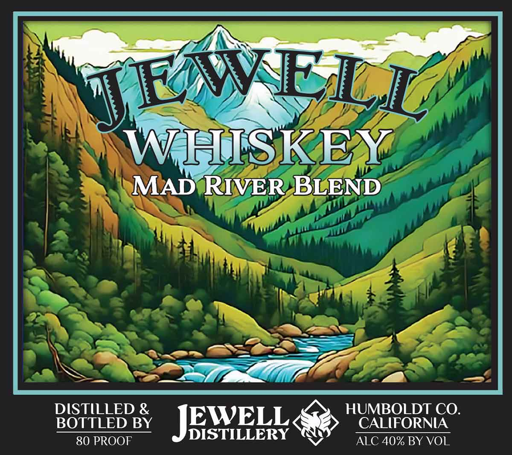

# TTB COLA Label Images - TTBID 26232001000537

**Brand Name:** JEWELL

**Issue Date:** 09/01/2026

**Origin Code:** 01

**Product Class/Type:** 140

**Source:** [TTB Public COLA Registry](https://ttbonline.gov/colasonline/viewColaDetails.do?action=publicFormDisplay&ttbid=26232001000537)

## Label Images

### Back Label

### Front Label

## Extracted Label Text

*Text extracted via OCR - may contain errors*

**Detected Proof:** 80

### Back Label

MAD RIVER
JESVEEL
DISTILLERY
WHISKEY
THIS UNIQUE PREMIUM WHISKEY OFFERS ROBUST SWEET
AROMATICS WITH AN INTEGRATED FLAVOR BLEND OF SWEET
TOA STED GRAIN, CREAMY VANILLA, LIGHT OAK, RICH COFFEE
AND COCOA WITH A LONG LINGERING FINISH.
EVERY JEWELL BATCH IS BLENDED WITH PURE MOUNTAIN
SPRING WATER DRAWN DIRECTLY FROM THE MOUNTAINS OF
HUMBOLDT COUNTY.
CHEERSI
FINE ARTISAN SPIRITS HANDCRAFTED IN SMALL BATCHES
Batch No::
GOVERNMENT WARNING: (1) ACCORDING TO THE
SURGEON GENERAL, WOMEN SHOULD NOT DRINK
JESELL
ALCOHOLIC
BEVERAGES
DURING
PREGNANCY
DISTILLERY
BECAUSE OF THE RISK OF BIRTH DEFECTS. (2)
Distilled & Bottled by
CONSUMPTION OF ALCOHOLIC BEVERAGES IMPAIRS
YOUR ABILITY TO
DRIVE A
CAR OR  OPERATE
Jewell Distillery; Inc;
MACHINERY, AND MAY CAUSE HEALTH PROBLEMS.
I20 Monda Way; Unit €
Blue Lake, CA 95525
65723
38750
2
80 PROOF
ALC 40% BY VOL | 750 ML
wwwjewelldistillery com

### Front Label

JEWELE
WHISKEY
MAD RIVER BLEND
DISTILLED &
HUMBOLDT CO.
BOTTLED BY
JESVELL
CALIFORNIA
80 PROOF
ALC 40% BY VOL
