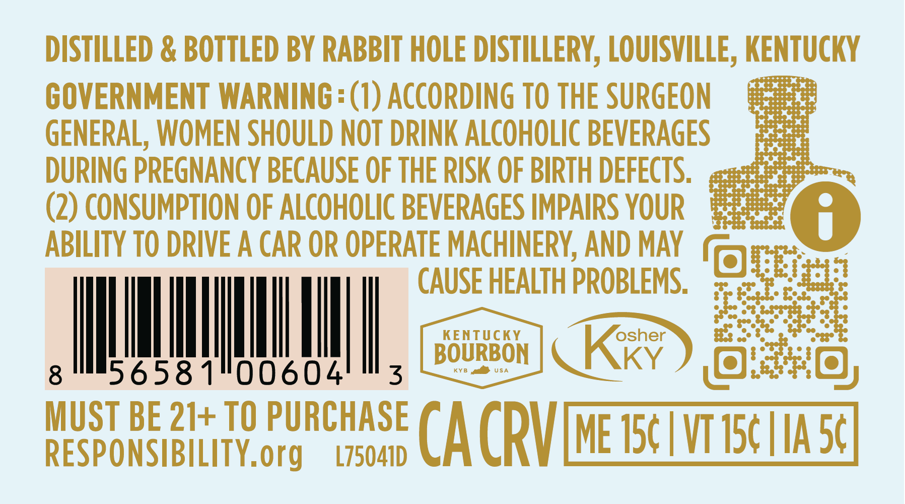
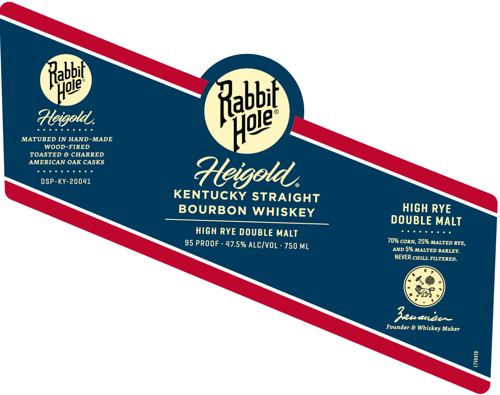
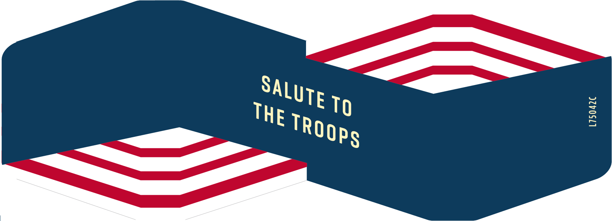

# TTB COLA Label Images - TTBID 26232001000623

**Brand Name:** RABBIT HOLE

**Fanciful Name:** HEIGOLD

**Issue Date:** 09/02/2026

**Origin Code:** 22

**Product Class/Type:** 101

**Source:** [TTB Public COLA Registry](https://ttbonline.gov/colasonline/viewColaDetails.do?action=publicFormDisplay&ttbid=26232001000623)

## Label Images

### Back Label

### Front Label

### Label 2

## Extracted Label Text

*Text extracted via OCR - may contain errors*

*1 image(s) excluded: text did not meet readability threshold*

**Detected Proof:** 95

### Back Label

DISTILLED & BOTTLED BY RABBIT HOLE DISTILLERY, LOUISVILLE, KENTUCKY

eee, seeed ays

555553

as3°SSe88)

GOVERNMENT WARNING =(1) ACCORDING TO THE SURGEON

GENERAL, WOMEN SHOULD NOT DRINK ALCOHOLIC BEVERAGES

GV

DURING PREGNANCY BECAUSE OF THE RISK OF BIRTH DEFECTS.

aehhe se

Ss sSeey

Sse

(2) CONSUMPTION OF ALCOHOLIC BEVERAGES IMPAIRS YOUR

ae

ABILITY TO DRIVE A CAR OR OPERATE MACHINERY, AND MAY fo

CAUSE HEALTH PROBLEMS.

KENTUCKY

ll

WN

KYB al usa

Kix)

a

Il

6581

00604

|| Rez

BOURBON sti] Ki) fo i 10}

MUST BE 21+ TO PURCHASE

RESPONSIBILITY.org

L75041D

CA CRV EET

### Front Label

Rabbt
Heigold
MATURED IN HAND
MADE
WOOD-FIRED
TOASTED & CHARRED
AMERICAN OAK CASKS
DSP-KY-20041
Heigotd
KENTUCKY STRAIGHT
BOURBON WHISKEY
HIGH RYE
DOUBLE MALT
HIGH RYE DOUBLE MALT
95 PROOF
47.5% ALC/VOL ' 750 ML
70% CORN , 25% MALTED RYE,
AND
5% MALTED BARLEY.
NEVER CHILL FILTERED.
Zeu aze _
Founder & Whiskey Maker
1
Hpie
Rabbi
Hole
