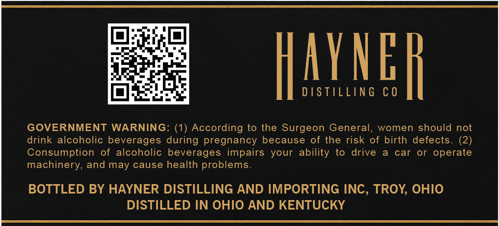
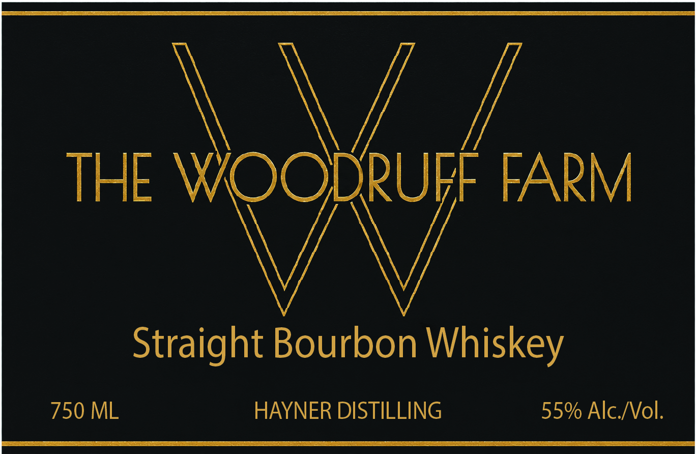

# TTB COLA Label Images - TTBID 26233001000075

**Brand Name:** HAYNER DISTILLING

**Fanciful Name:** THE WOODRUFF FARM

**Issue Date:** 08/27/2026

**Origin Code:** 09

**Product Class/Type:** 101

**Source:** [TTB Public COLA Registry](https://ttbonline.gov/colasonline/viewColaDetails.do?action=publicFormDisplay&ttbid=26233001000075)

## Label Images

### Back Label

### Front Label

## Extracted Label Text

*Text extracted via OCR - may contain errors*

### Back Label

a eer lcm cca ce ka ec nieell
a
lpia lel
ms Pairs 4
Op ssterats DISTILLING CO
GOVERNMENT WARNING: (1) According to the Surgeon General, women should not
drink alcoholic beverages during pregnancy because of the risk of birth defects. (2)
Consumption of alcoholic beverages impairs your ability to drive a car or operate
machinery, and may cause health problems.
BOTTLED BY HAYNER DISTILLING AND IMPORTING INC, TROY, OHIO
DISTILLED IN OHIO AND KENTUCKY

### Front Label

THE WOODRUFF FARM

\

Straight Bourbon Whis skey
