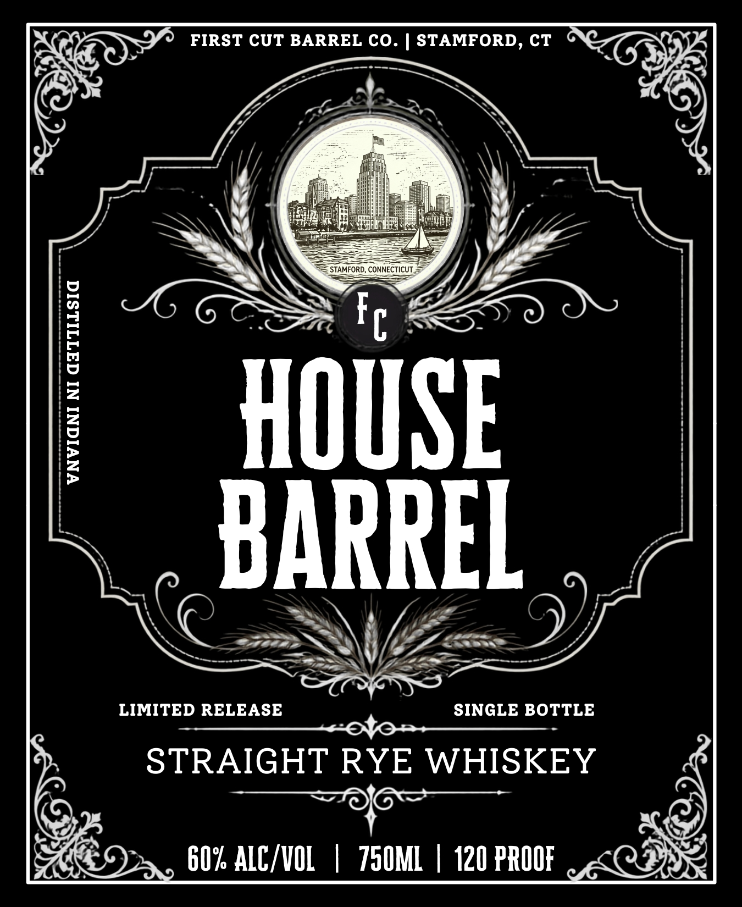

# TTB COLA Label Images - TTBID 26233001000147

**Brand Name:** HOUSE BARREL

**Issue Date:** 09/11/2026

**Origin Code:** 14

**Product Class/Type:** 102

**Source:** [TTB Public COLA Registry](https://ttbonline.gov/colasonline/viewColaDetails.do?action=publicFormDisplay&ttbid=26233001000147)

## Label Images

### Back Label

### Front Label

## Extracted Label Text

*Text extracted via OCR - may contain errors*

**Detected Proof:** 120

### Back Label

BOTTLED
BY
FIRST CUT BARREL CO
STAMFORD_
CT
GOVERNMENT WARNING:
(1) According to the Surgeon General, women should not drink
alcoholic beverages during pregnancy because of the risk of birth
defects
(2) Consumption of alcoholic beverages impairs your ability to drive
a car or operate machinery, and may cause health problems_

### Front Label

FIRST CUT BARREL CO.
STAMFORD, CT
STAMFORD, CONNECTICUT
1
Fc
2
7
HOUSE
BARREL
LIMITED RELEASE
SINGLE BOTTLE
STRAIGHT RYE WHISKEY
60% ALC/VOL
750ML
120 PROOF
