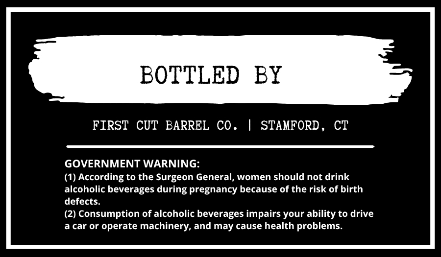
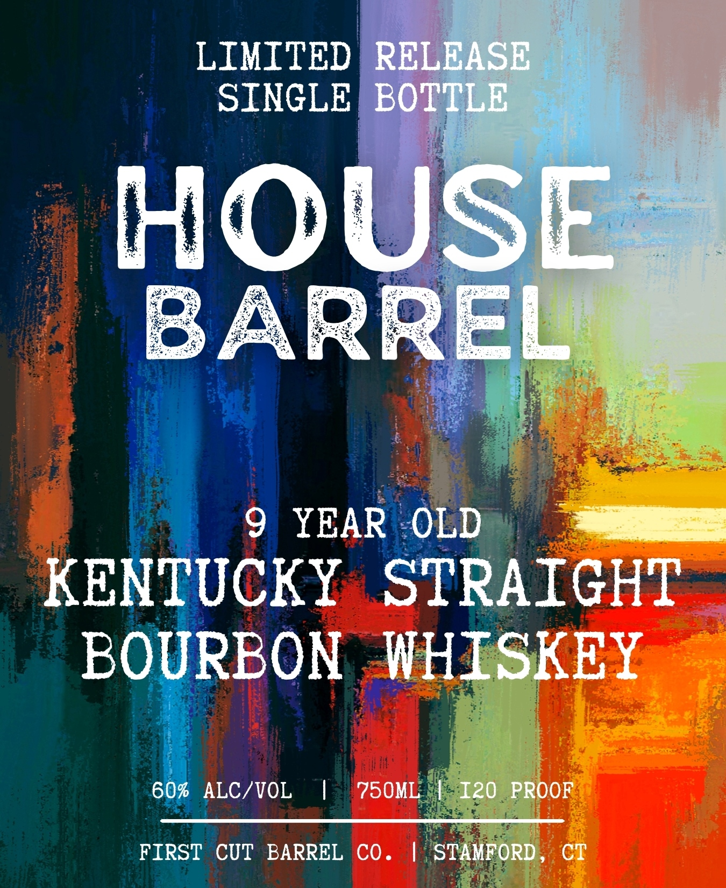

# TTB COLA Label Images - TTBID 26233001000150

**Brand Name:** HOUSE BARREL

**Issue Date:** 09/11/2026

**Origin Code:** 14

**Product Class/Type:** 101

**Source:** [TTB Public COLA Registry](https://ttbonline.gov/colasonline/viewColaDetails.do?action=publicFormDisplay&ttbid=26233001000150)

## Label Images

### Back Label

### Front Label

## Extracted Label Text

*Text extracted via OCR - may contain errors*

**Detected Proof:** 120
**Detected Age:** 9 Years

### Back Label

BOTTLED
BY
FIRST CUT BARREL CO
STAMFORD_
CT
GOVERNMENT WARNING:
(1) According to the Surgeon General, women should not drink
alcoholic beverages during pregnancy because of the risk of birth
defects
(2) Consumption of alcoholic beverages impairs your ability to drive
a car or operate machinery, and may cause health problems_

### Front Label

LIMITED
RELEASE
SINGLE
BOTTLE
HOUSE
BARREL
9
YEAR
OLD
KENTUCKY
STRAIGHT
BOURBON
WHISKEY
60%
ALC/VOL
75OML;
I20 PROOF
FIRST
CUT
BARREL
Co
STAMFORD
CT
