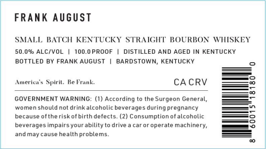

# TTB COLA Label Images - TTBID 26233001000165

**Brand Name:** FRANK AUGUST

**Issue Date:** 08/28/2026

**Origin Code:** 22

**Product Class/Type:** 101

**Source:** [TTB Public COLA Registry](https://ttbonline.gov/colasonline/viewColaDetails.do?action=publicFormDisplay&ttbid=26233001000165)

## Label Images

### Label 1

### Label 2

## Extracted Label Text

*Text extracted via OCR - may contain errors*

**Detected Proof:** 100

### Label 1

FRANK August
SMALL BATCH KENTUCKY STRAIGHT BOURBON WHSKEY
50.09 ALC/VOL
100.0 PROOF
DISTILLED AND AGED IN KENTUCKY
BOTTLED BY FRANK AUGUST
BARDSTOWN; KENTUCKY
Ameriea ` Spiril.
Ke Frank.
CA CRV
GOVERNMENT WARNING; (1) According to the
Surgeon General,
womenshouldnot
drink alcoholic beverages during pregnancy
because oftheriskofbirth defects
(2) Consumption of alcoholic
S
beverages impairsyour ability -
drive
caror operate
machinery;
8
and may cause health problems.

### Label 2

SMIALL BATCH
KENTUCKY STRAIGHT BOURBON WVHISKEY
50.0 % ABV
100-0 PROOF
1
250 ML
