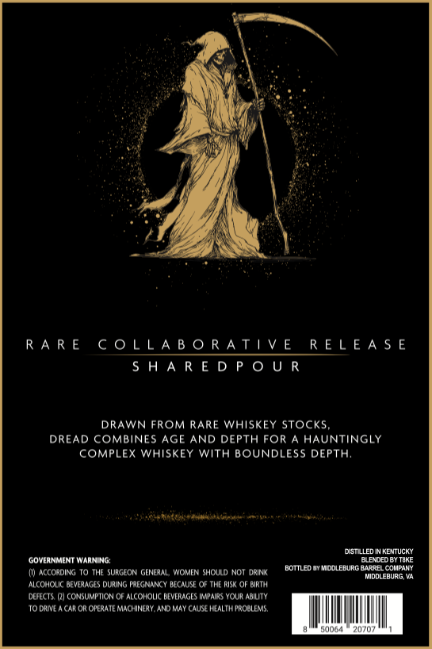
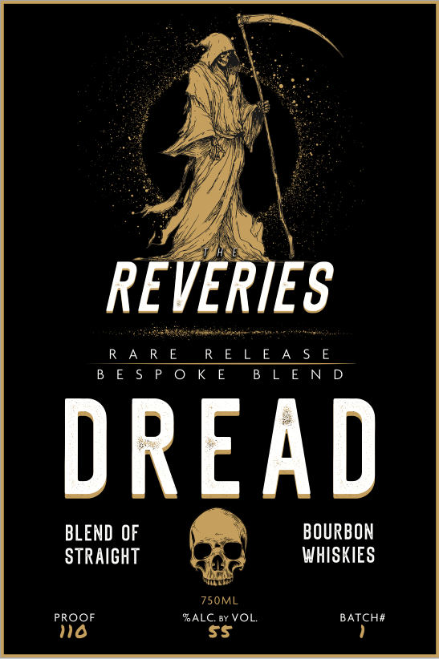

# TTB COLA Label Images - TTBID 26233001000171

**Brand Name:** REVERIES

**Fanciful Name:** DREAD

**Issue Date:** 09/03/2026

**Origin Code:** 02

**Product Class/Type:** 121

**Source:** [TTB Public COLA Registry](https://ttbonline.gov/colasonline/viewColaDetails.do?action=publicFormDisplay&ttbid=26233001000171)

## Label Images

### Back Label

### Label 1

## Extracted Label Text

*Text extracted via OCR - may contain errors*

### Back Label

RARE COLLABORATIVE RELEASE
SHAREDPOUR

DRAWN FROM RARE WHISKEY STOCKS,
DREAD COMBINES AGE AND DEPTH FOR A HAUNTINGLY
COMPLEX WHISKEY WITH BOUNDLESS DEPTH.

‘GOVERNMENT WARNING: BLENDED BY THE
() ACCORDING TO THE SURGEON GENERAL, WOMEN SHOULD NOT oRNK BOTTLED BYAIDOLESURG BARRE COMPANY
"ALCOHOLIC BEVERAGES DURING PREGNANCY BECALSE OF THE RISK OF BATH

DUFECTS. 2) CONSUMPTION OF ALCONOIC BEVERAGES IMPAIRS YOUR ABILITY
‘TODRIV ACAROR OPERATE MACHINERY, AND MAY CAUSE HEALTH PROBLEMS

### Label 1

en

fy

RE

ES

ini

RARE RELEASE _

RELEASE

BESPOKE

BLEND

DREAD

BLEND OF

BOURBON

STRAIGHT

WHISKIES

©

750ML

PROOF

)

ALC. ay VOL.

BATCH#
