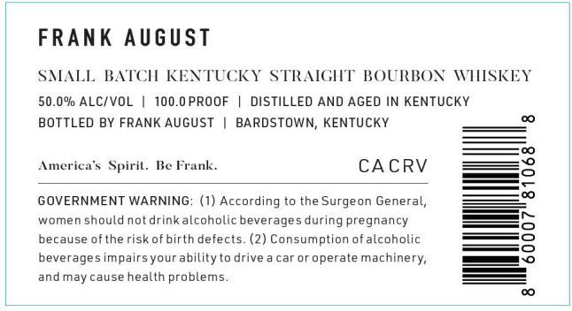
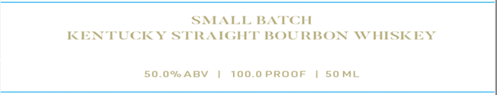

# TTB COLA Label Images - TTBID 26233001000179

**Brand Name:** FRANK AUGUST

**Issue Date:** 08/28/2026

**Origin Code:** 22

**Product Class/Type:** 101

**Source:** [TTB Public COLA Registry](https://ttbonline.gov/colasonline/viewColaDetails.do?action=publicFormDisplay&ttbid=26233001000179)

## Label Images

### Front Label

### Label 2

## Extracted Label Text

*Text extracted via OCR - may contain errors*

**Detected Proof:** 100

### Front Label

FRANK August
SMALL BATCH KENTUCKY STRAIGHT BOURBON MHSKEY
50.0% ALCIVOL
100.0 PROOF
DISTILLED AND AGED IN KENTUCKY
BOTTLED BY FRANK AUGUST
BARDSTOWN, KENTUCKY
America $ Spiril_
Be Frank.
CACRV
GOVERNMENT WARNING: (1) According to the Surgeon General,
women should not drinkalcoholic beverages during pregnancy
because ofthe risk of birth defects. (2) Consumption ofalcoholic
beverages impairsyourability to drive
car or operate machinery;
and may cause health problems_

### Label 2

SMALL BATCH

KEN PUCK Y STRAIGHT BOURBON WHISKEY

50.0% ABV

|

100.0 PROOF

| SOML
