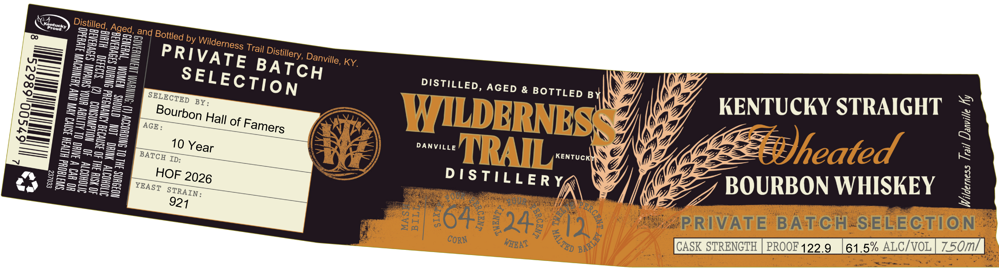
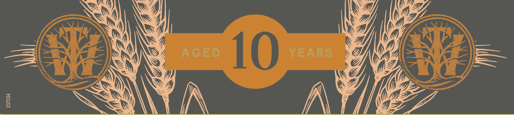
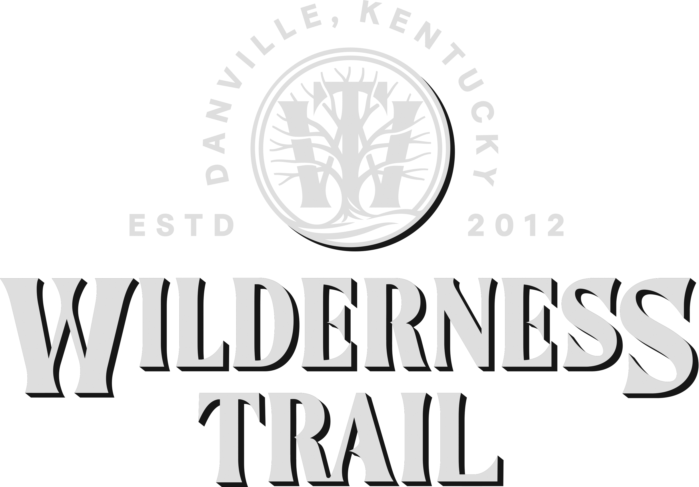

# TTB COLA Label Images - TTBID 26233001000186

**Brand Name:** WILDERNESS TRAIL

**Fanciful Name:** WHEATED

**Issue Date:** 08/27/2026

**Origin Code:** 22

**Product Class/Type:** 141

**Source:** [TTB Public COLA Registry](https://ttbonline.gov/colasonline/viewColaDetails.do?action=publicFormDisplay&ttbid=26233001000186)

## Label Images

### Label 1

### Label 2

### Label 3

## Extracted Label Text

*Text extracted via OCR - may contain errors*

*2 image(s) excluded: text did not meet readability threshold*

**Detected Proof:** 122.9

### Label 1

Aged, and
by
KY
1
3
2
DistiLLED, AGED & BOTTLED BX
3
BY :
8
3
2
KENTUCKY STRAIGHT
=
==
of
WILDBRNES
J
53
10
DANVILLE
MRL"
KENTUCK
Wheated
1
1
4
1
2
HOF
DTSTILLER Y
5
BOURBON WHISKEY
48;
Cp
3
pq
4
645
2
249
RRIVATE
BATCH
SELECTion
CORN
WEAT
CASK STRENGTH
PROOF 122.9
61.5% ALCIvOL
75oml
Distilled,
Kontucky
Froud
1
1
3
Bottled
1
1
1
Wilderness
Trail
PRIVATE
Distillery,
]
Danville,
1
BATCH
1
8
1
SELECTION
0
1
SELECTED
2
1
8
Bourbon
E
Hall
1
1
Famers
AGE
1
1
Year
3
3
BATCH
1
1
1
1
1
1
2026
YEAST
STRAIN :
921
YERCEA,
6
BARLES
