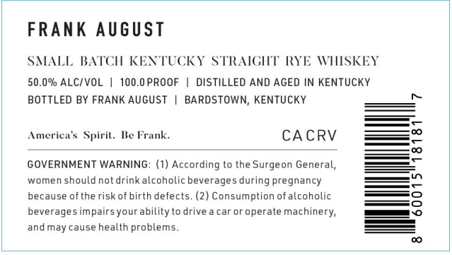

# TTB COLA Label Images - TTBID 26233001000192

**Brand Name:** FRANK AUGUST

**Issue Date:** 08/31/2026

**Origin Code:** 22

**Product Class/Type:** 102

**Source:** [TTB Public COLA Registry](https://ttbonline.gov/colasonline/viewColaDetails.do?action=publicFormDisplay&ttbid=26233001000192)

## Label Images

### Front Label

### Label 2

## Extracted Label Text

*Text extracted via OCR - may contain errors*

**Detected Proof:** 100

### Front Label

FRANK August
SALL BATCH KENTUCKY STRAICHT RYE WHISKEY
50.0% ALC/VOL
100.0 PROOF
DISTILLED AND AGED IN KENTUCKY
BOTTLED BY FRANK AUGUST
BARDSTOWN; KENTUCKY
America <
Spiril.
Ie Frank_
CA CRV
GOVERNMENT WARNING: (1) According to the Surgeon General,
women should not drinkalcoholic
beverages during pregnancy
because ofthe risk of birth defects. (2) Consumption ofalcoholic
5
beverages impairsyourability to drive
caror operate
machinery,
andmay cause health problems

### Label 2

SMIALL BAIT CH
REN TUCK Y SIRAIGH I RYE W HISKE >)
| AR\ Oyo PrPRerh ; uu Mi
