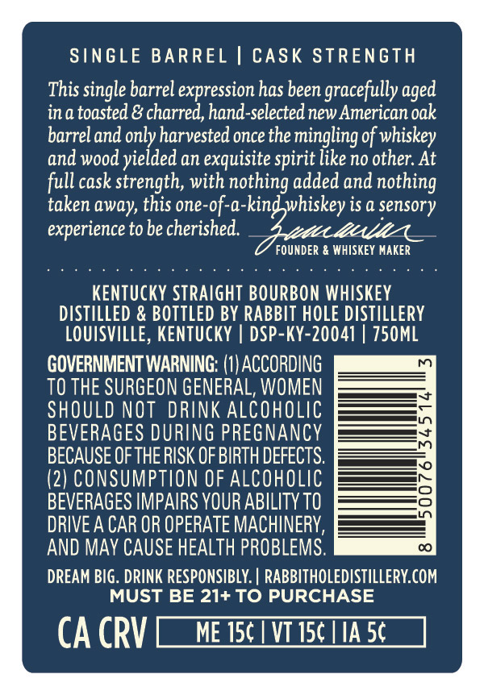
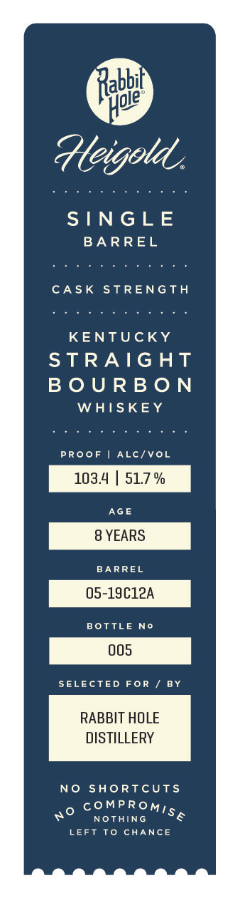
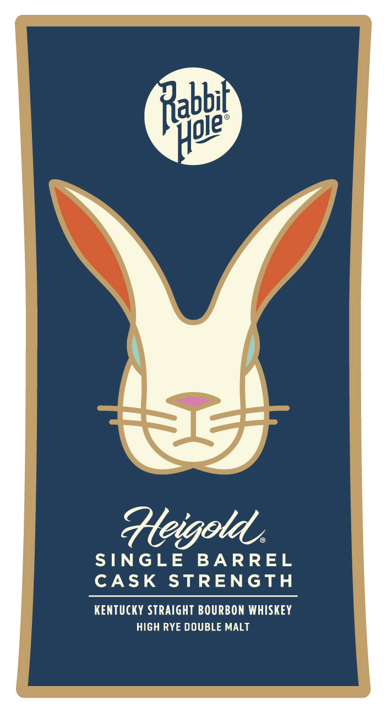
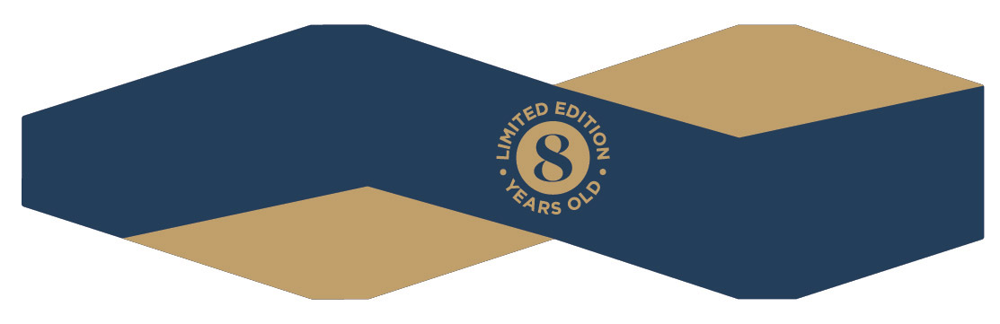

# TTB COLA Label Images - TTBID 26233001000234

**Brand Name:** RABBIT HOLE

**Fanciful Name:** HEIGOLD

**Issue Date:** 08/27/2026

**Origin Code:** 22

**Product Class/Type:** 101

**Source:** [TTB Public COLA Registry](https://ttbonline.gov/colasonline/viewColaDetails.do?action=publicFormDisplay&ttbid=26233001000234)

## Label Images

### Back Label

### Label 1

### Label 2

### Label 4

## Extracted Label Text

*Text extracted via OCR - may contain errors*

*1 image(s) excluded: text did not meet readability threshold*

### Back Label

SINGLE BARREL | CASK STRENGTH

This single barrel expression has been gracefully aged
ina toasted & charred, hand-selected new American oak
barrel and only harvested once the mingling of whiskey
and wood yielded an exquisite spirit like no other. At
full cask strength, with nothing added and nothing

taken away, this one-of-a-kind whiskey is a sensory
experience to be cherished.
FOUNDER & WHISKEY MAKER
KENTUCKY STRAIGHT BOURBON WHISKEY

DISTILLED & BOTTLED BY RABBIT HOLE DISTILLERY
LOUISVILLE, KENTUCKY | DSP-KY-20041 | 750ML

GOVERNMENT WARNING: (1) ACCORDING
TO THE SURGEON GENERAL, WOMEN ———=
SHOULD NOT DRINK ALCOHOLIC
BEVERAGES DURING PREGNANCY
BECAUSE OF THE RISK OF BIRTH DEFECTS.
(2) CONSUMPTION OF ALCOHOLIC
BEVERAGES IMPAIRS YOUR ABILITY TO
DRIVE A CAR OR OPERATE MACHINERY,
AND MAY CAUSE HEALTH PROBLEMS.

DREAM BIG. DRINK RESPONSIBLY. | ee
MUST BE 21+ TO PURCH

CA CRV [ne TTA

### Label 1

abbi

le

ld,

AGO

SINGLE

BARREL

CASK STRENGTH

KENTUCKY

STRAIGHT

BOURBON

WHISKEY

PROOF | ALC/VOL

AGE

BARREL

BOTTLE No

Pos

SELECTED FOR / BY

RABBIT HOLE

DISTILLERY

NO SHORTCUTS

o COMPROM,.

NOTHING

LEFT TO CHANCE

### Label 2

abbil
gle
pv ¢
SINGLE BARREL
CASK STRENGTH
KENTUCKY STRAIGHT BOURBON WHISKEY
HIGH RYE DOUBLE MALT
