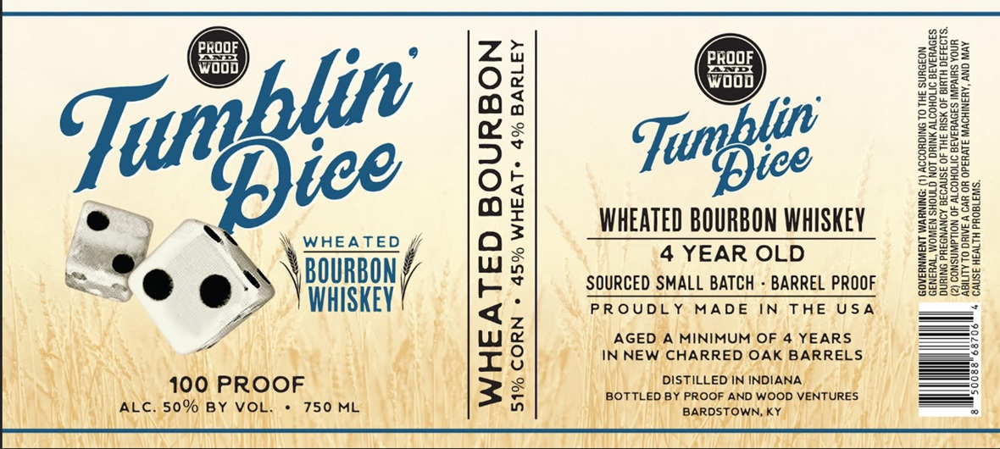

# TTB COLA Label Images - TTBID 26233001000290

**Brand Name:** TUMBLIN' DICE

**Issue Date:** 08/28/2026

**Origin Code:** 22

**Product Class/Type:** 141

**Source:** [TTB Public COLA Registry](https://ttbonline.gov/colasonline/viewColaDetails.do?action=publicFormDisplay&ttbid=26233001000290)

## Label Images

### Back Label

## Extracted Label Text

*Text extracted via OCR - may contain errors*

**Detected Age:** 4 Years

### Back Label

és gees

O28 5 a PROOF ae

4 e ey) gee

g 52238

85553

ae a Pree

e ~~ Ce z WHEATED BOURBON WHISKEY 2223

. WHEATED / {a} tind EA EIA DIAL eT BSGEES

ie . BOURBON, ws 4 YEAR OLD Hae
=@ @: f- * | SOURCED SMALL BATCH - BARREL PROOF Sgsa2

2 y i Zo» WHISKEY \ c- (e | PROUDLY MADE IN THE USA =
LAS, Aoi she uN We} AGED a MINIMUM oF yee hs sb
A PINRO lll Gay le sees Tw
 oopRoor Se] tems! |)
(Vi keaiiertonnne || |B] lpeetgeacieeene | a
MAGA TL UM A ce Cee Sick Gite yl fae BO MRINI PINT ATi Aaaln eae age On ll tay) be anny
