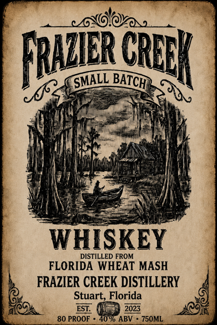
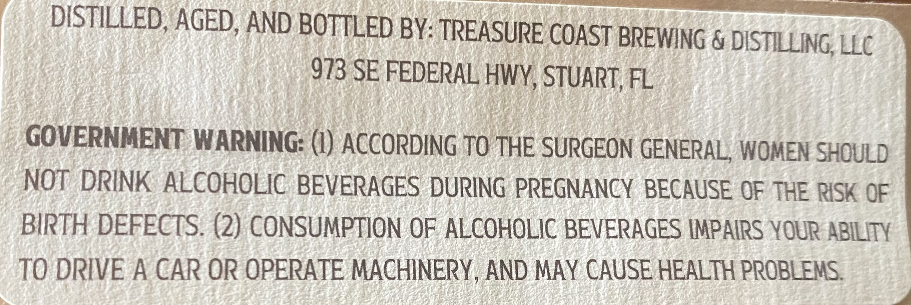

# TTB COLA Label Images - TTBID 26233001000330

**Brand Name:** FRAZIER CREEK

**Issue Date:** 08/31/2026

**Origin Code:** 16

**Product Class/Type:** 140

**Source:** [TTB Public COLA Registry](https://ttbonline.gov/colasonline/viewColaDetails.do?action=publicFormDisplay&ttbid=26233001000330)

## Label Images

### Label 1

### Label 2

## Extracted Label Text

*Text extracted via OCR - may contain errors*

**Detected Proof:** 80

### Label 1

fWola
Iud
WHISKEY
DISTILLED FROM
FLORIDA
WHEAT MASH
FRAZIER CREEK DISTILLERY
Stuart, Florida
ESL
2023
80 PROOF
40% ABV
7S0ML
CRDK
BATCH}
SMALL

### Label 2

DISTILLED, AGED, AND BOTTLED BY: TREASURE COAST BREWING & DISTILLING
LLC
973 SE FEDERAL HWY, STUART, FL
GOVERNMENT WARNING: (I) ACCORDING TO THE SURGEON GENERAL, WOMEN SHOULD
NOT DRINK ALCOHOLIC BEVERAGES DURING PREGNANCY BECAUSE OF THE RISK QF
BIRTH DEFECTS. (2) CONSUMPTION OF ALCOHOLIC BEVERAGES IMPAIRS YOUR ABILITY
TO DRIVE A CAR OR OPERATE MACHINERY, AND MAY CAUSE HEALTH PROBLEMS
