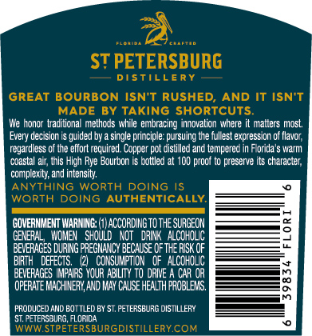
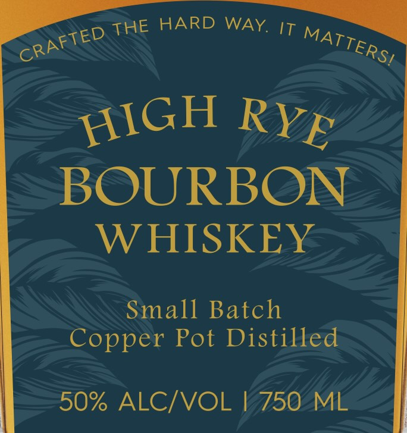

# TTB COLA Label Images - TTBID 26233001000349

**Brand Name:** ST PETERSBURG DISTILLERY

**Issue Date:** 09/09/2026

**Origin Code:** 16

**Product Class/Type:** 141

**Source:** [TTB Public COLA Registry](https://ttbonline.gov/colasonline/viewColaDetails.do?action=publicFormDisplay&ttbid=26233001000349)

## Label Images

### Back Label

### Front Label

### Label 1

### Label 4

## Extracted Label Text

*Text extracted via OCR - may contain errors*

*1 image(s) excluded: text did not meet readability threshold*

**Detected Proof:** 100

### Back Label

ST PETERSBURG
DISTILLERY
GREAT BOURBON
ISNT RUSHED;
AND IT ISNT
MADE BY TAKING SHORTCUTS
We honar  traditicnal methcds while embracing innovaticn where
maiters most
Every decision
guided by
single principle: pursuing the fullest expression of flavor,
regardless of Ihe effort required. Copper pot distilled and tempered E
Florida'
warm
coastal ait, inis High Rye Bourbon
bottled at 1CO proof
preserve its chzracter;
complexity; and intensity;
ANYTHING
WORTH
DOING
WORTH DOING
AUTHENTICALLY
GOVERNIENT WARMING:
acCOfDIGTOTHe SURGEON
GEERAL ,  WXOMEN   Should
KOT   dRINk   ALCOHOLIC
BEVERAGES DURING PREGMANCY BECAUSE OfTHE FuSK OF
ETH
DEFECTS;
COHSUMPT ON   €f   ALCOHOC
BEVEFAGES IpAIRS YOUR ABILITY T0 DRIE
CAR OR
OpERATE MCHNERY AND MAY CauSe HEalth proBLEHS,
PRODUCED AND BOTILED BY ST, PETERSBURG DISTILLERY
ST, PFTERSBURG; FLORILA
WWW STPETERSBURGDISTILLERYCOM

### Front Label

HARD WAY
IT
BOURBON
WHISKEY
Small Batch
Copper Pot Distilled
50% ALCIVOL
750
ML
THE
CRAFTED
MATTERSI
HIGH
RYE

### Label 1

FLO RID A
C R A FTE D
ST PETERSBURG
D I $
LLE R Y
