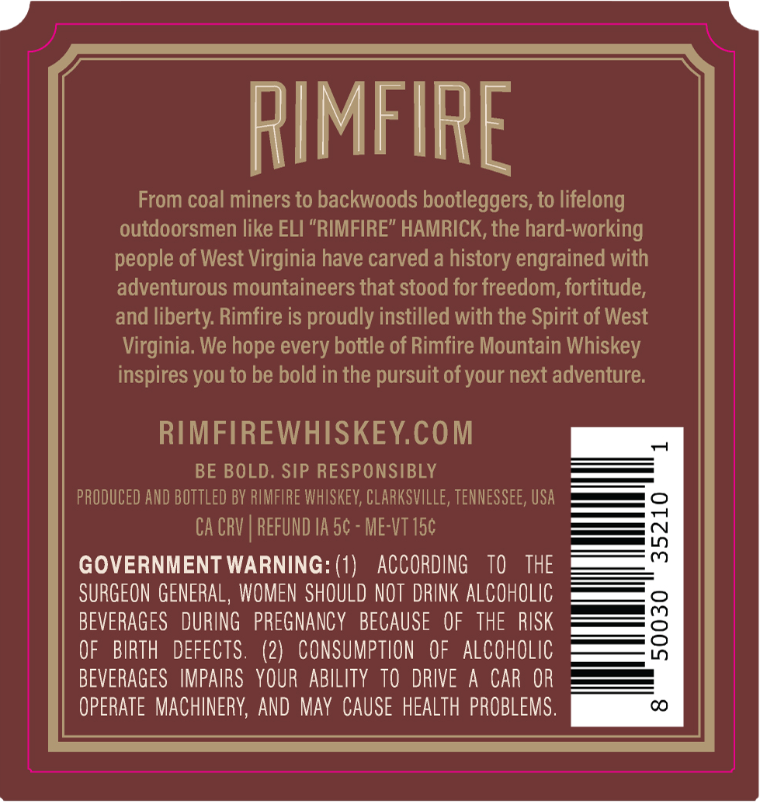
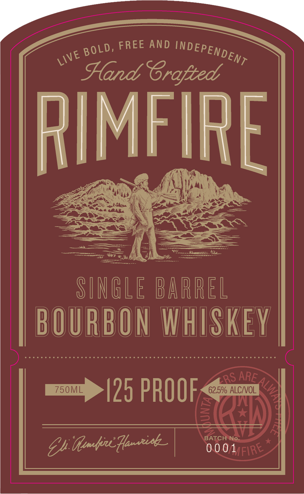

# TTB COLA Label Images - TTBID 26233001000352

**Brand Name:** RIMFIRE

**Issue Date:** 09/21/2026

**Origin Code:** 43

**Product Class/Type:** 140

**Source:** [TTB Public COLA Registry](https://ttbonline.gov/colasonline/viewColaDetails.do?action=publicFormDisplay&ttbid=26233001000352)

## Label Images

### Back Label

### Front Label

## Extracted Label Text

*Text extracted via OCR - may contain errors*

**Detected Proof:** 125

### Back Label

RIMFIPE
From coal miners to backwoods bootleggers, to lifelong
outdoorsmen like ELI "RIMFIRE" HAMRICK, the hard-working
people of West Virginia have carved a history engrained with
adventurous mountaineers that stood for freedom, fortitude,
and liberty: Rimfire is proudly instilled with the Spirit of West
Virginia  We hope every bottle of Rimfire Mountain Whiskey
inspires you to be bold in the pursuit ofyour next adventure:
RIMFIREWHISKEYCOM
BE BOLD . SIP RESPONSIBLY
pROduCeD AND bottled BY RIMFIRE WhISKeV; Clarksville, TENNESSEE, USA
Ca CRV | REFUND IA 5c - ME-VT 15c
1
GOVERNMENT WARNING: (1)
ACCORDING
TO
THE
SURGEON GENERAL , WOMEN  SHOULD NOT DRINK ALCOHOLIC
BEVERAGES   DURING
PREGNANCY
BECAUSE   OF   THE RISK
8
OF
BIRTH
DEFECTS.
(2)   CONSUMPTION
OF   ALCohOlIC
BEVERAGES  IMPAIRS   YOUR ABILITY TO  DRIVE
A CAR OR
OpERATE  MachineRY; AND May  CAUSE HEALTH  PROBLEMS.
CO

### Front Label

\

« BOLD, FREE AND INDEPEN Dg,

Hard Crotted

rea

Mey

nt

eS

2 oS

7h BAND

SINBLE DARREL

BOURB

ON WHISKEY

eee e reece eee rere cere ere e en ee eres sre ee sees eeeeeseessreseseees

as ARE

mam |75 PROC

62.5% ALC/VOL

2)

EG)

—-— i

Gl Mme, finns |

RO OA Fac

AYE
