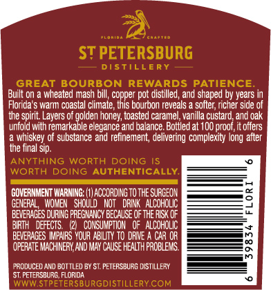
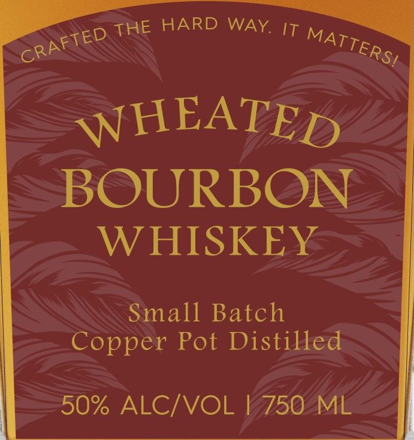

# TTB COLA Label Images - TTBID 26233001000353

**Brand Name:** ST PETERSBURG DISTILLERY

**Issue Date:** 09/09/2026

**Origin Code:** 16

**Product Class/Type:** 141

**Source:** [TTB Public COLA Registry](https://ttbonline.gov/colasonline/viewColaDetails.do?action=publicFormDisplay&ttbid=26233001000353)

## Label Images

### Back Label

### Front Label

### Label 2

### Label 4

## Extracted Label Text

*Text extracted via OCR - may contain errors*

*1 image(s) excluded: text did not meet readability threshold*

**Detected Proof:** 100

### Back Label

ST PETERSBURG
DISTILLERY
GREAT BOURBON REWARDS
PATIENCE
Built on
wheated mash bill; copper pot distilled, and shaped by years
Florida
wari coastal clmate ; Iis bourbon reveals
soiter; richer Side 0f
the spirit. Layers of golden honey, toasted caramel; vanilla custard and oak
unfold with remarkable elegance and balance  Botlled at 100 proof it offers
whiskey of substance and refinement, delivering complexity long aiter
tne final sip.
ANYTHING
WORTH
DOING
WORTH DOING AUTHENTICALLY
GOVERNMENT WARNING; (1| ACCORDING TO the SURGEON
GENERAL
WOMEN   ShQuld
NoT   DFINK   ALCOHOLIC
BEVERACES DUFWG PRECHANCY BECAUSE Of THE AISK OF
BIRTH   DEFECTS
(21   CONSUMPTION
OF   ALCOHOLIC
BEVERAGES IMPAIRS
QUR AE UTY TO DANE
CAR UH
m
OPERATE MACHINEFI AND MaY Cause HEALTh FRQBLEMS.
8
FrodUCEv AND BOT TLED BY ST. PETERSBURG DISTLLERY
ST PETERSBLRG,
LORIDA
WWW STPETERSBURGDISTILLERYCOM

### Front Label

HARD WAY. IT
WHEATED
BOURBON
WHISKEY
Small Batch
Copper Pot Distilled
50% ALCIVOL
750
ML
THE
CRAFTED
MATTERSI

### Label 2

FLO RID A
C R A FTE D
ST PETERSBURG
D I $
LLE R Y
