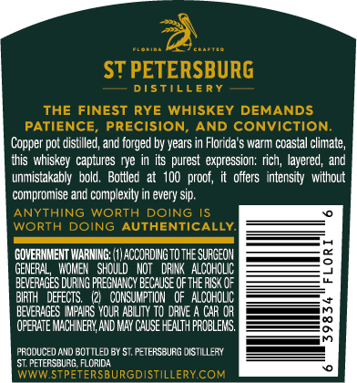
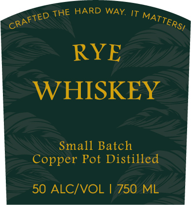

# TTB COLA Label Images - TTBID 26233001000360

**Brand Name:** ST PETERSBURG DISTILLERY

**Issue Date:** 09/08/2026

**Origin Code:** 16

**Product Class/Type:** 142

**Source:** [TTB Public COLA Registry](https://ttbonline.gov/colasonline/viewColaDetails.do?action=publicFormDisplay&ttbid=26233001000360)

## Label Images

### Back Label

### Front Label

### Label 2

### Label 4

## Extracted Label Text

*Text extracted via OCR - may contain errors*

*1 image(s) excluded: text did not meet readability threshold*

**Detected Proof:** 100

### Back Label

ST PETERSBURG
DISTILLERy
THE FINEST RYE WHISKEY DEMANDS
PATIENCE
PRECISION
AND CONViCTION:
Copper pot distilled, and forged by years in Florida $ warm ccastal
this whiskey captures rye in its purest  expression: rich; layered, and
unmistakably   bold;
Bottled at  100  proof;
it  offers   intensity   without
compromise and complexity in every Sip.
ANYTHING
WORTH
DOING
WORTH DOING AUTHENTICALLY:
GOVERNMENT VARNING;
accoRdINGtothE SUAGEON
GENEFAL   WOMEX   Should
Not   DRIK   ALCOHOLIC
BEVERAGES DURING PFEGMANCY BECAuSE OfthE RISKOF
BIFIH
DEFECTS;
(21   CONCUMPTION   QF   ALCOHOLIC
BEVERAGES MfaRS YQUR ABLITY TO dRIE
LAH UH
OFERATE MACHINEFY ARD MY CAlSE HEALT H PFOBLEMS,
8
PR JDUCED AND BOT TLED BY 5T, PETERSBUR S DISTILLERY
ST: PETERSBURG FLCRIDA
WWWSTPETERSBURGDISTILLERYCOM
climate,

### Front Label

THE HARD WAY. IT
RYE
WHISKEY
Small Batch
Copper Pot Distilled
50 ALCIVOL
750 ML
CRAFTED
MATTERSI

### Label 2

FLO RID A
C R A FTE D
ST PETERSBURG
D I $
LLE R Y
