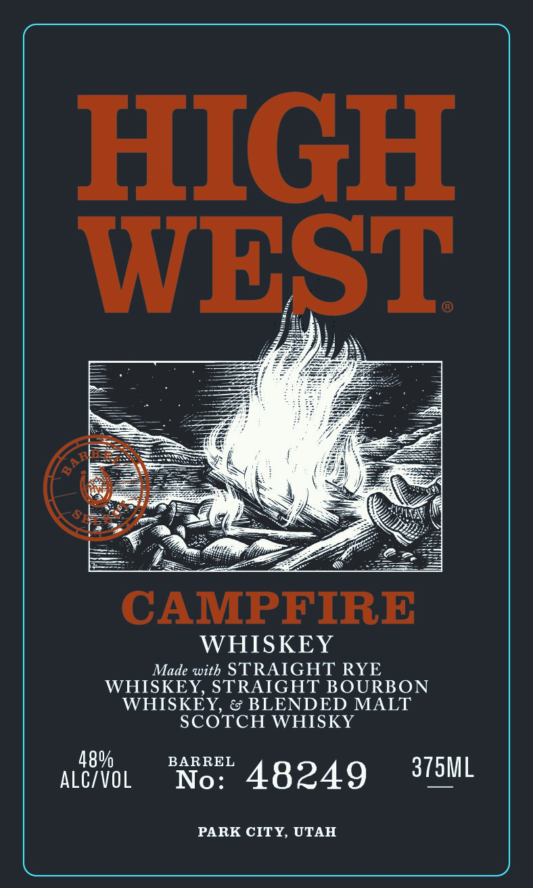
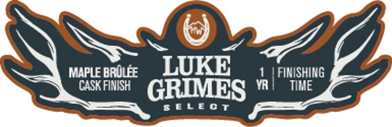
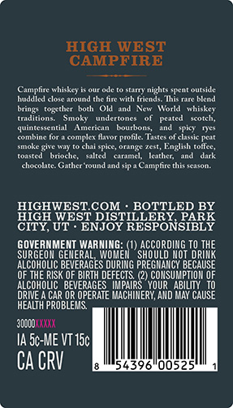

# TTB COLA Label Images - TTBID 26233001000368

**Brand Name:** HIGH WEST

**Fanciful Name:** CAMPFIRE BARREL SELECT

**Issue Date:** 09/09/2026

**Origin Code:** 45

**Product Class/Type:** 140

**Source:** [TTB Public COLA Registry](https://ttbonline.gov/colasonline/viewColaDetails.do?action=publicFormDisplay&ttbid=26233001000368)

## Label Images

### Label 1

### Label 2

### Label 3

## Extracted Label Text

*Text extracted via OCR - may contain errors*

### Label 1

HIGH

WEST

SES

GF

Cae

CAMPFIRE

WHISKEY

Made with STRAIGHT RYE

WHISKEY, STRAIGHT BOURBON

WHISKEY, & BLENDED MALT

SCOTCH WHISKY

BARREL

ALCIVOL

No

48249

375ML

PARK CITY, UTAH

### Label 2

MAPLE BRULEE
LUKE
FINISHING
CASK FIMISH
GRIMES
VR
TIMe
8€L80 T

### Label 3

HIGH WEST
CAMPFIRE
(eamchtethicic
Onndt
Aee
nights  Tent outside
muduled corearouind te nne Iith Iricnds
Umie Tutc bicnu
O1d
Lac
Tonio
inicact
Trtdtttone
Sinon
undctioncs
Scotch;
quonicetentn
Wcng-
hourpona
ntannmm
comple Ibtor
Tastet ol chsic pcat
mot
chai spice; orange Zest,
English toflce,
Toneu
Iorioche
Walled
Onmci
Ieatiler
dark
choconi
Gathcr tound
(camnplte thieeonl
HIGHWESTCOM
BOTTLED BY
HIGH WEST DISTILLERY
CITY, UT
ENJOY
'EESPONSIEEK
GOVERMMENT WARNING
ACCOROIMG TO
TORTHE
SURGEON GEMERAL
WOME
SHOULO MOT
ALCOHOLIC BEVERAGES OURING PREGMANCY BECAUSE
OF THE RISK OF BIPTH DEFECTS
CONSUMPTIOH OF
ILCOHOLIC   BEVERAGES
MPAIRS   YOUR
ABILITY   T0
ORIVE
CAR OR OPERATE MACHIMERY, AHD MAY CAUSE
hEALTh PROBLEMS
JOodo "Kaka
Ia 5c-ME VT I5c|
CA CRV
439
005
bring
{ogether
Pealcd
prolle;
nder
