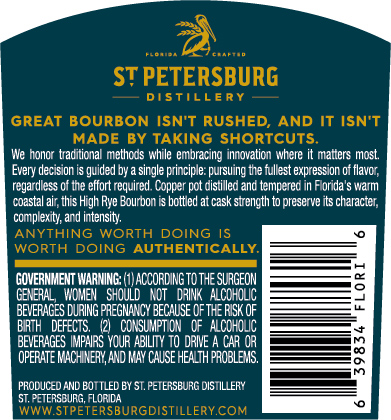
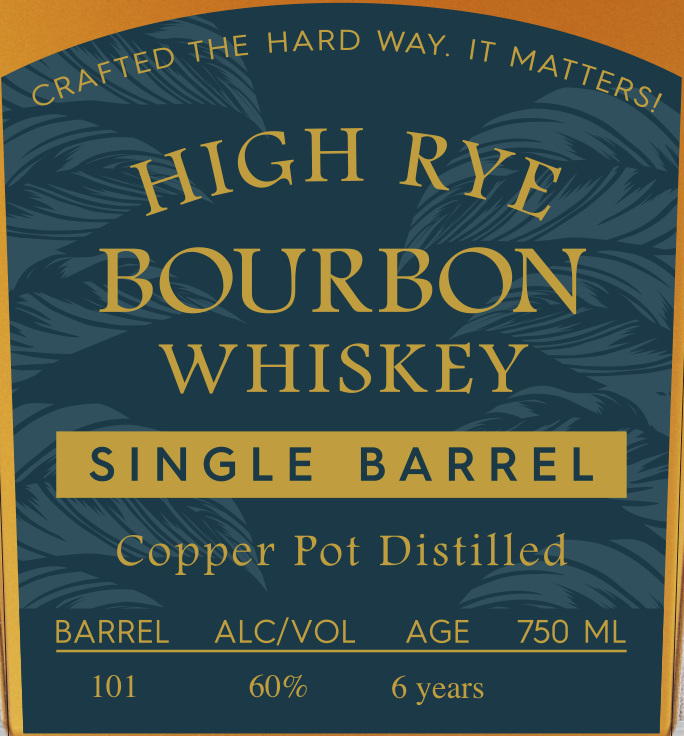

# TTB COLA Label Images - TTBID 26233001000373

**Brand Name:** ST PETERSBURG DISTILLERY

**Issue Date:** 09/09/2026

**Origin Code:** 16

**Product Class/Type:** 101

**Source:** [TTB Public COLA Registry](https://ttbonline.gov/colasonline/viewColaDetails.do?action=publicFormDisplay&ttbid=26233001000373)

## Label Images

### Back Label

### Front Label

### Label 2

### Label 4

## Extracted Label Text

*Text extracted via OCR - may contain errors*

*1 image(s) excluded: text did not meet readability threshold*

**Detected Proof:** 120
**Detected Age:** 6 Years

### Back Label

ST PETERSBURG
DISTillery
GREAT BOURBON ISN'T RUSHED,
AND IT ISNT
MADE BY TAKING SHORTCUTS
We honor  traditicnal methc ds while embracing innovaticn where
malters most
Every decision
guided by
single principle: pursuing te fullest expression of flavor;
regardless of Ihe effort required. Copper pot distilled and tempered [
Florida'
warm
coastal ait this High Rye Bourbon
bottled at cask sbrength
preserve its chzracter;
complexity; and intensity;
ANYTHING
WORTH
DOING
WORTH DOING
AUTHENTICALLY
GOVERNIAENT WARMING:
ACCORDINGTOThe SURGEON
GENERAL   WXOMEM   ShouLd
KOt   drink  ALCOhOLC
BEVERAGES DURING PREGHANCY BECAUSE Of THE FISK OF
EITH
DEFECTS:
COHSUMPT ON   Of  ALCOHQUC
BEVERAGES IMpAIRS YOUR ABILITy T0 dRIE
CaR OR
OpERATE MACHERY AND MAY CauSe HEalth paobLEMS.
PRODUCED AND BOTILED BY ST. FETERSBURG DISTILLERY
st,poicrSBURG; FLORIDA
WWWSTPETERSBURGDISTILLERYCOM

### Front Label

HARD WAY
IT
BOURBON
WHISKEY
S[NGLE
BA RREL
Copper Pot Distilled
BARREL
ALCIVOL
AGE
750
ML
101
60%
6 years
THE
CRAFTED
MATTERSI
HIGH
RYE

### Label 2

FLO RID A
C R A FTE D
ST PETERSBURG
D I $
LLE R Y
