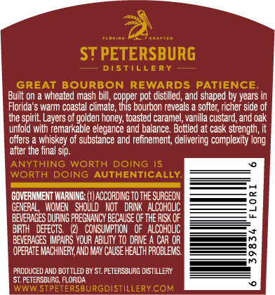
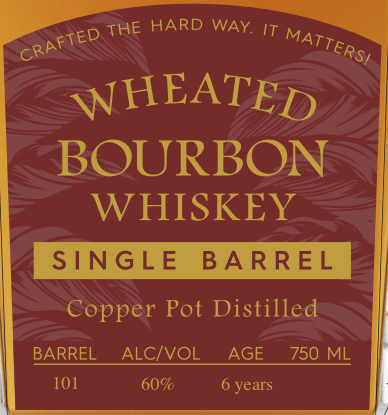

# TTB COLA Label Images - TTBID 26233001000378

**Brand Name:** ST PETERSBURG DISTILLERY

**Issue Date:** 09/09/2026

**Origin Code:** 16

**Product Class/Type:** 101

**Source:** [TTB Public COLA Registry](https://ttbonline.gov/colasonline/viewColaDetails.do?action=publicFormDisplay&ttbid=26233001000378)

## Label Images

### Back Label

### Front Label

### Label 2

### Label 4

## Extracted Label Text

*Text extracted via OCR - may contain errors*

*1 image(s) excluded: text did not meet readability threshold*

**Detected Proof:** 120
**Detected Age:** 6 Years

### Back Label

ST PETERSBURG
DISTILLERY
GREAT BOURBON REWARDS PATIENCE
Built on
wheated mash bill; copper pot distilled, and shaped by years
Florida
wari coastal Clmate , inis bourbon reveals
soiter; richer Side of
the spirit: Layers
golden honey; toasted caramel,vanilla custard, and oak
unfold with remarkable elegance and balance. Botlled at cask strength;
offers
whiskey of substance and refinement, delivering complexity long
after the final sip.
ANYTHING
WORTH
DOING
WORTH DOING AUTHENTICALLY
GOVERNMENT WARNING: (1) ACCORDING TO the SURGEON
GENERAL
WOMEH   Should
Not   DFINK   ALCoHOLIC
BEVERACES DURIG PREGMANCY BECAUSE Of THE RISK OF
BIRTH   DEFECTS
(21  CONSUMPTION
0F   ALCOHOLIC
BEVERAGES IMPAIRS VOUR AE LTY TO drNE
CAR UH
m
OPERATE MACHINEFI AND MaY Cause HEALTh FROBLEMS.
8
FRCdUCEd ANd BOTTLED 6Y ST. PETERSBURG DISTLLER
ST, PETERSBL RG, FLORIDA
WWWSTPETERSBURGDISTILLERYCOM

### Front Label

THE HARD WAY
WHEATED
BOURBON
WHISKEY
SNGLE
BA RREL
Copper Pot Distilled
BARREL
ALcIVOL
AGE
750 ML
101
60%
6 years
CRAFTED
MATTERSI

### Label 2

FLO RID A
C R A FTE D
ST PETERSBURG
D I $
LLE R Y
