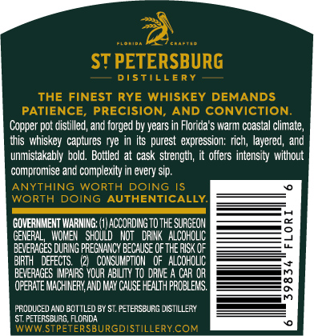
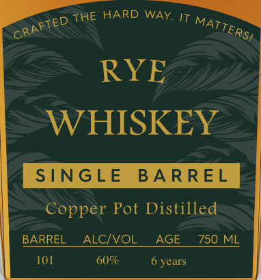

# TTB COLA Label Images - TTBID 26233001000386

**Brand Name:** ST PETERSBURG DISTILLERY

**Issue Date:** 09/09/2026

**Origin Code:** 16

**Product Class/Type:** 142

**Source:** [TTB Public COLA Registry](https://ttbonline.gov/colasonline/viewColaDetails.do?action=publicFormDisplay&ttbid=26233001000386)

## Label Images

### Back Label

### Front Label

### Label 2

### Label 4

## Extracted Label Text

*Text extracted via OCR - may contain errors*

*1 image(s) excluded: text did not meet readability threshold*

**Detected Proof:** 120
**Detected Age:** 6 Years

### Back Label

ST PETERSBURG
DSTILLERy
THE FINEST RYE WHISKEY DEMANDS
PATIENCE
PRECISION,
AND CONVICTION:
Copper pot distiled, and forged by years in Florida $ warm coastal
this whiskey  captures rye in its purest  expression: rich, layered , and
unmistakably bold. Bottled at cask strength;
offers  intensity without
compromise and complexity in every Sip.
ANYTHING
WORTH
DOING
WORTH DOING AUTHENTICALLY
GOVERNMENT WARNING; {1)acCORDING TOthE SURGEON
GENEFAL   WOMEM   Should
Not   DFIK   ALCOHQLIC
BEVERAGES DURING PFEGMANCY EECAUCE OfTHE RICKOF
BIFIH
DEFECTS;
CONSUMPTION   oF   ALCOHOLIC
BEVERAGES MpaRS YQUR ABLITY TO dRIVE
CAR WH
OFERATE MACHINERY AXD MY CAlSE HEALT H PFOBLEMS,
8
PRODUCED AND BOT TLED BY ST. PETERSBURG DISTILLERY
ST PETERSBURG; FLCRIDA
WWWSTPETERSBURGDISTILLERYCOM
climate,

### Front Label

THE HARD WAY IT
RYE
WHISKEY
SNGLE
BA RREL
Copper Pot Distilled
BARREL
ALcIVOL
AGE
750 ML
101
60%
6 years
CRAFTED
MATTERSI

### Label 2

FLO RID A
C R A FTE D
ST PETERSBURG
D I $
LLE R Y
