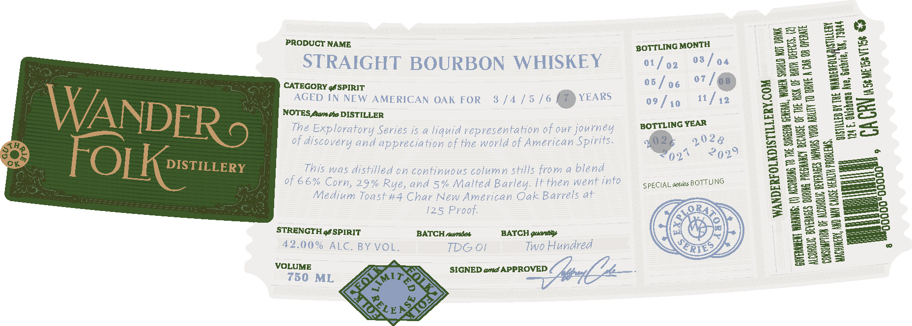
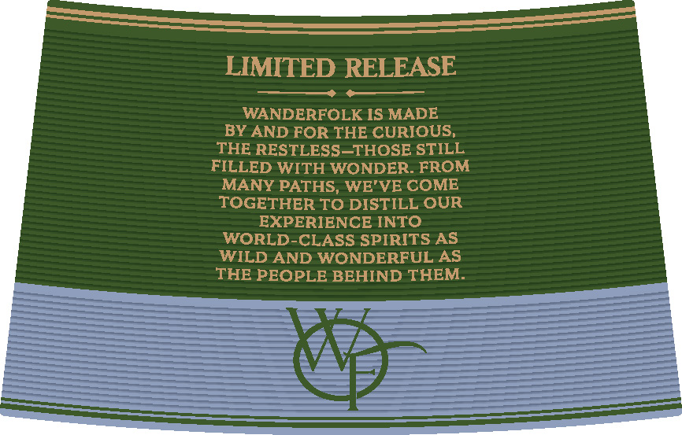

# TTB COLA Label Images - TTBID 26233001000409

**Brand Name:** WANDER FOLK

**Issue Date:** 09/02/2026

**Origin Code:** 37

**Product Class/Type:** 101

**Source:** [TTB Public COLA Registry](https://ttbonline.gov/colasonline/viewColaDetails.do?action=publicFormDisplay&ttbid=26233001000409)

## Label Images

### Front Label

### Label 2

## Extracted Label Text

*Text extracted via OCR - may contain errors*

**Detected Proof:** 125
**Detected Age:** 6 Years

### Front Label

—s

sa

Bea

BS

See

ae

PRODUCT NAME

BOTTLING MONTH

pay

See

eae

ae

=a

se

STRAIGHT BOURBON WHISKEY

01/02

03/04

SL2

aes

Ee

22

Be

Ba

2S

aS

Se

=e

CATEGORY géSPIRIT

05 / 06 o7/@

2=3

eZ

AGED IN NEW AMERICAN OAK FOR 8 /4/5 /6

YEARS

11/42

Se

=e

2a

09 f 19

Ee

=e

Se

NOTES ante DISTILLER

Bue

Bee

Bac

BOTTLING YEAR

Bee

ns

26

The Exploratory Series is a liquid representation of our journey

Bee

2==

Bac

aS

of discovery and appreciation of the world of American Spirits.

192¢

Bees

2929

=eBak

222

This was distilled on continuous column stills from a blend

Sane

oe

2a

—————

———]

of 66% Corn, 29% Rye, and 5% Malted Barley. IFthen went into

SPECIAL detdzs BOTTLING

Bees

B2=2

(=== to]

Medium Toast#4 Char New American Oak Barrels at

Bee

J

Bow

=o

Be

2a

125 Proof.

Baz

BAN

Bee

a

——=O

STRENGTH gé SPIRIT

BATCH awndos

BATCH guaniy

wall

=aol=

Be

22

ES

SS

42.00% ALC. BY VOL.

IDG Oi

Two Hundred

SORE

2252

232

Bs

322

Be

VOLUME

750 ML

@

### Label 2

LIMITED RELEASE
WANDERFOLK IS MADE
BY AND FOR THE CURIOUS,
THE RESTLESS_THOSE STILL
FILLED WITH WONDER. FROM
MANY PATHS, WE'VE COME
TOGETHER TO DISTILL OUR
EXPERIENCE INTO
WORLD-CLASS SPIRITS AS
WILD AND WONDERFUL AS
THE PEOPLE BEHIND THEM:
